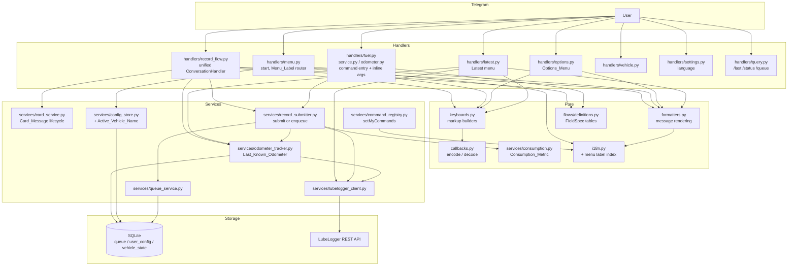
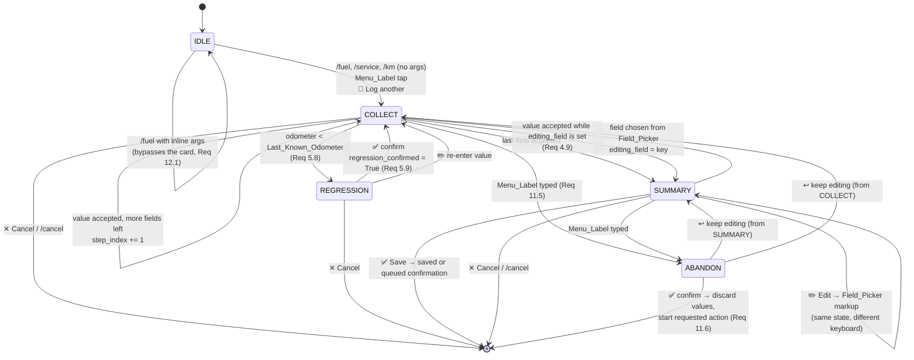
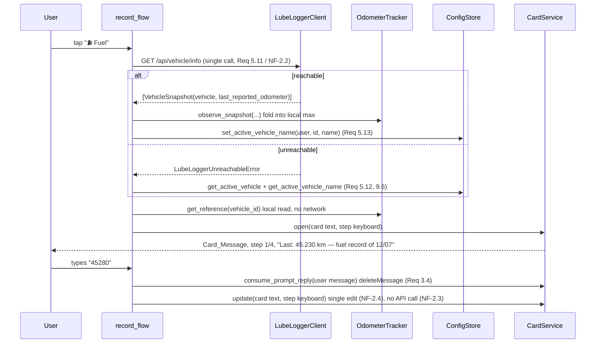

# Design Document: Improve UX

## Overview

This feature replaces the bot's "one message per prompt" interaction with a single self-updating
**Card_Message** per operation, a permanent navigation **Menu_Keyboard**, smart defaults taken from
the vehicle's own history, and a confirmation step that can correct one field without restarting the
flow. It also fixes six inconsistencies in the current handlers (Requirement 13).

The design is driven by two hard constraints of the Telegram Bot API, verified before design:

1. `editMessageText` and `editMessageReplyMarkup` accept **only** `InlineKeyboardMarkup`. A
   `ReplyKeyboardMarkup` cannot be edited; it can only be replaced by sending a new message.
2. `deleteMessage` may delete a message sent by another user in a private chat since Bot API 4.2,
   within a 48-hour window.

From (1) follows the single interaction paradigm: the reply keyboard is **static navigation only**
and is never swapped during a flow, while every in-flow action is an inline button on the
Card_Message. From (2) follows the Card_Message lifecycle: typed answers to bot prompts are deleted
after being read, so the card stays the last message in the chat.

### Key Design Decisions

| # | Decision | Rationale |
|---|----------|-----------|
| 1 | Reply keyboard = navigation, inline keyboard = actions. Never mixed. | Forced by the Bot API edit constraint above. Mixing the two produces either a growing chat or a keyboard that cannot be edited. |
| 2 | One Card_Message per operation, edited in place; typed replies deleted. | Requirement 3. Keeps the chat readable and makes the current state of the operation unambiguous. |
| 3 | Field_Picker instead of restarting a flow. | Requirement 4.8. Correcting one typo must not cost four re-entries. |
| 4 | Menu_Keyboard with 5 buttons on 2 rows, writing actions separated from reading ones. | Requirement 1.2/1.8. "🚧 Odometer" writes, "📊 Latest" reads; the old "Km" label did not convey that. |
| 5 | No vehicle-list cache. One live `get_vehicle_snapshots()` call at flow start. | NF-2.1/2.2. The call is also the connectivity probe and the wake-up for instances that idle down, so the instance is warm by the time the record is saved. |
| 6 | Last_Known_Odometer = max over the vehicle's latest gas / service / odometer record and every value the bot itself submitted or queued. | Requirement 5.4. A refuel does not create an odometer record, so no single record type is authoritative. |
| 7 | Odometer regression is a soft warning with explicit confirmation, never a rejection. | Requirement 5.8/5.10. Odometer replacements and data-entry order make hard rejection wrong. Today the only constraint is `gt=0`. |
| 8 | Flow_Token in every in-flow `callback_data`; values never travel in `callback_data`. | Requirement 11.1/11.3. Keeps stale buttons harmless and the 64-byte budget provable. |
| 9 | One unified `ConversationHandler` for the three record flows instead of three. | Requirement 11.5/11.6 needs "tap Service while entering fuel" to abandon one flow and start another. A state of one `ConversationHandler` cannot be returned from another, so cross-flow navigation is only expressible inside a single handler. |
| 10 | Keyboards and message rendering extracted into two modules of pure functions. | NF-1.1/1.2. Layout and text become assertable without a `Bot` instance or network. |
| 11 | HTML parse mode with mandatory escaping of every value from a user or from the API. | Requirement 11.7. A description like `oil change <5000km` currently breaks delivery. |
| 12 | Inline-argument mode keeps bypassing card, summary and confirmation. | Requirement 12.1. It is the fastest path and must not become slower. |

---

## Resolved Open Question

**Question (Requirement 6.5):** does `GET /api/vehicle/gasrecords` return a fuel economy value
already computed by LubeLogger?

**Answer: yes.** The endpoint returns a `fuelEconomy` field. Requirement 6.5 is therefore the
primary path and Requirement 6.6 the fallback.

Sources consulted (LubeLogger source, `hargata/lubelog`, branch `main`, read via
`raw.githubusercontent.com`; the published wiki only says that endpoint documentation lives at
`/api` on each instance, without a schema):

- [Controllers/API/GasController.cs](https://github.com/hargata/lubelog/blob/main/Controllers/API/GasController.cs)
  — routes `/api/vehicle/gasrecords` and `/api/vehicle/gasrecords/all`.
- [Models/Shared/ImportModel.cs](https://github.com/hargata/lubelog/blob/main/Models/Shared/ImportModel.cs)
  — `GasRecordExportModel`, the projection actually serialized.
- [Helper/GasHelper.cs](https://github.com/hargata/lubelog/blob/main/Helper/GasHelper.cs)
  — the fuel economy computation.
- [Models/API/TypeConverter.cs](https://github.com/hargata/lubelog/blob/main/Models/API/TypeConverter.cs)
  — the invariant-culture converters.
- [Models/API/MethodParameter.cs](https://github.com/hargata/lubelog/blob/main/Models/API/MethodParameter.cs)
  — the query parameters bound on every GET.
- [Helper/StaticHelper.cs](https://github.com/hargata/lubelog/blob/main/Helper/StaticHelper.cs)
  — `GetInvariantOption()`, which sets the camelCase naming policy.
- [Logic/VehicleLogic.cs](https://github.com/hargata/lubelog/blob/main/Logic/VehicleLogic.cs)
  and [Controllers/APIController.cs](https://github.com/hargata/lubelog/blob/main/Controllers/APIController.cs)
  — `/api/vehicle/info` and `LastReportedOdometer`.
- Cross-check against an independent client:
  [thaapaniemi/go-lubelogger-api, gasrecords/structs.go](https://github.com/thaapaniemi/go-lubelogger-api/blob/main/gasrecords/structs.go)
  — declares the JSON field as `fuelEconomy`, which confirms the serialized name.

*Content rephrased from the sources for licensing compliance; the findings below are our own
summary of the code's behaviour.*

### Findings that shape the design

**F1 — `fuelEconomy` exists and is authoritative.** The GET projection fills it from the view
model's computed mileage figure. JSON name: `fuelEconomy` (the serializer uses a camelCase naming
policy).

**F2 — `0` means "not available", not "zero consumption".** The computation yields `0` when: the
record is the first one for the vehicle, `missedFuelUp` is set, the fill was not a fill-to-full (the
volume is deferred and accumulated into the next full fill), the odometer delta is `0` or negative,
or the volume is not positive. Consequence: the bot must treat `fuelEconomy <= 0` exactly like an
absent value and fall back to Requirement 6.6. This is the single most important finding — a naive
implementation would print "0.0 L/100km" on every partial fill.

**F3 — the unit depends on query parameters, not on the instance.** Every GET binds `useMPG` and
`useUKMPG`, both defaulting to `false`. With both false the figure is computed as
`100 / (distance / volume)`, i.e. **volume per 100 distance units** — L/100 km when the instance
stores litres and kilometres. The bot therefore never sends `useMPG`/`useUKMPG` and labels the value
`L/100 km`, which satisfies NF-6.2. Known limitation (already recorded in NF-5.2): on an instance
storing gallons and miles the same field means gallons per 100 miles, and the bot's label would be
wrong. This is documented, not detected.

**F4 — LubeLogger's own figure aggregates deferred partial fills; the bot's estimate cannot.** The
helper accumulates volume and distance across non-full fills and attributes the total to the next
full fill. The bot's own computation (Requirement 6.6/6.7) only looks at the current and previous
record. The two numbers can legitimately differ, which is exactly why 6.6 requires the label
"estimate".

**F5 — the response shape changes with the invariant setting.** `LUBELOGGER_INVARIANT_API` (or the
per-request header `culture-invariant`) swaps the JSON converters:

| | default (culture-dependent) | invariant |
|---|---|---|
| dates | JSON string, server short-date format, e.g. `12/07/2025` | JSON string `yyyy-MM-dd` |
| decimals | JSON string in server culture, e.g. `"4,52"` | JSON **number** |
| integers | JSON string | JSON **number** |
| booleans | JSON string `"True"`/`"False"` | JSON **boolean** |

So the same field can arrive as `"4,52"`, `"4.52"` or `4.52`. This is why NF-6.1 exists and why the
read models parse loosely. Two mitigations, applied together:

- the HTTP client sends `culture-invariant: true` on every request, which makes a modern instance
  answer in the deterministic column above without changing its configuration;
- the read models still accept both shapes, because the header is ignored by older versions.

**F6 — `/api/vehicle/info` returns `lastReportedOdometer` = the max mileage across record types.**
Called without `vehicleId` it returns one entry per vehicle, each containing the full vehicle object
plus that maximum. This is a server-side implementation of exactly the remote half of Requirement
5.4, available in **one** call. The flow-start call therefore targets `/api/vehicle/info` and falls
back to `/api/vehicles` when it is unavailable, which keeps Decision 5 intact (one live call, no
cache) while removing the staleness that a purely local Last_Known_Odometer would suffer. Tradeoff:
the endpoint aggregates counts and costs for all record types, so it is heavier than `/api/vehicles`;
acceptable on a self-hosted instance with a handful of vehicles, and it serves the wake-up purpose
better.

**F7 — ordering.** The gas records GET sorts by date, then odometer, before projecting, so
`records[-1]` is genuinely the latest gas record. The odometer records GET applies no explicit
ordering, so `records[-1]` is *not* guaranteed to be the latest there. Since Last_Known_Odometer is
a maximum folded into a monotonic local value, a mis-ordered list can only make the reference
under-report, never regress — and under-reporting is handled by the soft warning of Requirement 5.8.
Left as an accepted, documented risk (out of scope per the agreed decisions).

**F8 — write path.** `POST /api/vehicle/gasrecords/add` still requires `date`, `odometer`,
`fuelConsumed`, `cost`, `isFillToFull`, `missedFuelUp` as non-empty strings, exactly as the current
payload models produce. No change needed there.

---

## Architecture

### Component View



Everything in the **Pure** box is importable and callable with plain arguments: no `Bot`, no
network, no database. That box is where the property tests live (NF-1.1, NF-1.2, NF-1.4, NF-1.5).

### Layer rules

- Handlers own the Telegram plumbing and the conversation state. They never build markup or text
  inline; they call `keyboards.*` and `formatters.*`.
- `card_service` is the only place that calls `editMessageText`, `sendMessage` for a card, or
  `deleteMessage`.
- `record_submitter` is the only place that decides between "save" and "enqueue", so the
  inline-argument path and the guided path cannot diverge (Requirement 12.2).
- `odometer_tracker` is the only writer of `vehicle_state`.

### Conversation state machine

The three record flows share one `ConversationHandler`. The record kind, the collected values, the
current field index and the Flow_Token live in `FlowState` inside `context.user_data`, not in the
conversation state, so the number of states is independent of the number of fields.



`Field_Picker` is deliberately **not** a state: it is an alternative markup rendered on the summary
card, which keeps `SUMMARY` the single place that knows how to render collected values.

### Flow-start sequence



---

## Components and Interfaces

### `bot/callbacks.py` — callback_data codec *(new, pure)*

```python
class CallbackAction(StrEnum):
    CANCEL = "cx"
    SAVE = "sv"
    EDIT = "ed"
    FIELD = "fp"          # arg = field index
    KEEP = "kp"           # arg = field index, reuse suggested value
    CHOICE = "ch"         # arg = choice ordinal (full tank yes/no)
    ODO_CONFIRM = "oc"
    ODO_REENTER = "oe"
    LOG_ANOTHER = "la"
    LATEST_OPEN = "lo"    # arg = 0 fuel, 1 odometer
    LATEST_BACK = "lb"
    OPTIONS_OPEN = "oo"   # arg = 0 vehicle, 1 lang, 2 status, 3 queue
    OPTIONS_BACK = "ob"
    VEHICLE_SET = "vs"    # arg = vehicle id
    LANG_SET = "ls"       # arg = locale ordinal
    ABANDON_YES = "ay"    # arg = MenuAction ordinal
    ABANDON_NO = "an"


NO_TOKEN = "-"

def new_token() -> str: ...
def encode(action: CallbackAction, token: str = NO_TOKEN, arg: int | None = None) -> str: ...
def decode(data: str) -> Callback: ...   # Callback(action, token, arg)
```

Full definition of the grammar and the byte budget is in [Data Models](#callback_data-grammar).

### `bot/keyboards.py` — markup builders *(new, pure)*

Every function is synchronous, takes plain arguments plus a language code, and returns a Telegram
markup object. No I/O, no globals.

```python
def menu_keyboard(lang: str, *, placeholder_key: str | None = None) -> ReplyKeyboardMarkup: ...
def flow_step_keyboard(token: str, field: FieldSpec, *,
                       suggestion: int | None, lang: str) -> InlineKeyboardMarkup: ...
def choice_keyboard(token: str, field: FieldSpec, lang: str) -> InlineKeyboardMarkup: ...
def summary_keyboard(token: str, lang: str) -> InlineKeyboardMarkup: ...
def field_picker_keyboard(token: str, entries: Sequence[FieldEntry],
                          lang: str) -> InlineKeyboardMarkup: ...
def regression_keyboard(token: str, lang: str) -> InlineKeyboardMarkup: ...
def confirmation_keyboard(token: str, *, queued: bool, lang: str) -> InlineKeyboardMarkup: ...
def latest_menu_keyboard(lang: str) -> InlineKeyboardMarkup: ...
def latest_record_keyboard(lang: str) -> InlineKeyboardMarkup: ...
def options_menu_keyboard(lang: str) -> InlineKeyboardMarkup: ...
def options_back_keyboard(lang: str) -> InlineKeyboardMarkup: ...
def vehicle_keyboard(vehicles: Sequence[VehicleChoice], lang: str) -> InlineKeyboardMarkup: ...
def language_keyboard(lang: str) -> InlineKeyboardMarkup: ...
def abandon_keyboard(token: str, target: MenuAction, lang: str) -> InlineKeyboardMarkup: ...
def all_callback_data(lang: str) -> list[str]: ...   # test helper, enumerates every button
```

`menu_keyboard` returns the 5-button layout of Requirement 1.2:

```
[ ⛽ Fuel ] [ 🔧 Service ] [ 🚧 Odometer ]
[ 📊 Latest ]            [ ⚙️ Options ]
```

built with `is_persistent=True`, `resize_keyboard=True` (Requirement 1.1, Bot API 6.4) and
`input_field_placeholder=get_text(placeholder_key, lang)` when a placeholder key is supplied
(Requirement 3.8). `one_time_keyboard` is never set.

`confirmation_keyboard(queued=False)` yields `[🔁 Log another] [📊 Latest]` (Requirement 6.10);
`queued=True` yields only `[🔁 Log another]` (Requirement 9.4).

`all_callback_data` exists purely so the 64-byte test (NF-1.4) can enumerate every button the module
can produce without reflection tricks.

### `bot/formatters.py` — message rendering *(new, pure)*

```python
def esc(value: object) -> str: ...                      # html.escape(str(value), quote=False)
def fmt_plain(value: Decimal | float, lang: str) -> str  # decimal separator only, no grouping
def fmt_display(value: Decimal | float, lang: str, *, decimals: int = 2) -> str
def fmt_int(value: int, lang: str) -> str                # grouped, e.g. 45.230 / 45,230
def fmt_date(value: date, lang: str) -> str
def fmt_date_short(value: date, lang: str) -> str        # day/month, for the odometer reference

def render_progress(current: int, total: int, lang: str) -> str | None
def render_card(view: CardView, lang: str) -> str
def render_summary(view: SummaryView, lang: str) -> str
def render_regression(entered: int, reference: OdometerReference, lang: str) -> str
def render_confirmation(view: ConfirmationView, lang: str) -> str
def render_queued(view: ConfirmationView, lang: str) -> str
def render_cancelled(lang: str) -> str
def render_abandon_prompt(target: MenuAction, lang: str) -> str
def render_latest_fuel(record: GasRecord | None, vehicle_name: str,
                       consumption: ConsumptionResult | None, lang: str) -> str
def render_latest_odometer(record: OdometerRecord | None, vehicle_name: str, lang: str) -> str
def render_odometer_reference(reference: OdometerReference | None, lang: str) -> str
def render_welcome(vehicle_name: str | None, lang: str) -> str
```

Rules enforced here and nowhere else:

- every interpolated value coming from the user or from the API passes through `esc` exactly once;
- literal HTML markup (`<b>`, `<i>`, `<code>`) is only ever in the locale templates, never in a
  value;
- `render_progress` returns `None` when `total == 1`, which is how Requirement 4.2 is honoured
  without any per-flow special case.

`CardView`, `SummaryView` and `ConfirmationView` are frozen dataclasses (see Data Models) so a
renderer can be called from a test with a literal.

### `bot/flows/definitions.py` — field tables *(new, pure)*

```python
class FlowKind(StrEnum):
    FUEL = "fuel"
    SERVICE = "service"
    ODOMETER = "odometer"

class FieldKind(StrEnum):
    INT = "int"
    DECIMAL = "decimal"
    TEXT = "text"
    CHOICE = "choice"

@dataclass(frozen=True, slots=True)
class FieldSpec:
    key: str                 # "odometer" | "liters" | "cost" | "is_fill_to_full" | "description"
    kind: FieldKind
    prompt_key: str          # "ask_odometer"
    label_key: str           # "field_odometer"
    placeholder_key: str     # "ph_odometer"
    error_key: str           # "invalid_odometer"
    choices: tuple[str, ...] = ()   # locale keys, CHOICE only

FIELDS: Mapping[FlowKind, tuple[FieldSpec, ...]]

def field_count(kind: FlowKind) -> int: ...
def field_at(kind: FlowKind, index: int) -> FieldSpec: ...
def field_index(kind: FlowKind, key: str) -> int: ...
```

`FIELDS[FUEL]` = odometer, liters, cost, is_fill_to_full (4 data-entry steps).
`FIELDS[SERVICE]` = odometer, description, cost (3). `FIELDS[ODOMETER]` = odometer (1, so no
Progress_Indicator). The full-tank field is `CHOICE`, so Requirement 4.5 is satisfied by the table,
not by handler code.

### `bot/services/card_service.py` — Card_Message lifecycle *(new)*

```python
class CardService:
    def __init__(self, bot: Bot) -> None: ...

    async def open(self, chat_id: int, text: str,
                   markup: InlineKeyboardMarkup | None) -> int: ...
    async def update(self, chat_id: int, message_id: int, text: str,
                     markup: InlineKeyboardMarkup | None) -> int: ...
    async def finalize(self, chat_id: int, message_id: int, text: str,
                       markup: InlineKeyboardMarkup | None = None) -> int: ...
    async def strip_markup(self, chat_id: int, message_id: int) -> None: ...
    async def consume_prompt_reply(self, message: Message) -> None: ...
```

- `open` sends one message with `parse_mode=HTML` and returns its `message_id`, which the caller
  stores in `FlowState.card_message_id` (Requirement 3.1).
- `update` calls `edit_message_text`. `BadRequest("message is not modified")` is swallowed and the
  same id is returned. Any other `TelegramError` triggers the fallback of Requirement 3.7: send a
  new message with the same content and return **its** id, which the caller adopts as the new card.
  The return value is the reason this method returns an `int` rather than `None`.
- `finalize` is `update` plus the guarantee that the markup is either `None` or the follow-up
  keyboard of Requirements 6.10/9.4 (Requirement 3.9).
- `strip_markup` removes the buttons from a previous confirmation when "🔁 Log another" starts a new
  card, leaving the text intact (Requirement 7.3).
- `consume_prompt_reply` calls `delete_message` and swallows every `TelegramError` at DEBUG level
  (Requirement 3.6). It is called **only** from the in-flow typed-value handlers, which is the
  structural guarantee for Requirement 3.5 and NF-4.2: no other module imports `delete_message`.

### `bot/services/odometer_tracker.py` — Last_Known_Odometer *(new)*

```python
@dataclass(frozen=True, slots=True)
class OdometerReference:
    value: int
    on_date: date | None
    source: Literal["gas", "service", "odometer", "bot", "api"]

def fold(current: OdometerReference | None,
         candidate: OdometerReference | None) -> OdometerReference | None: ...   # pure

class OdometerTracker:
    def __init__(self, db_path: str) -> None: ...
    async def get_reference(self, vehicle_id: int) -> OdometerReference | None: ...
    async def observe(self, vehicle_id: int, candidate: OdometerReference) -> None: ...
    async def observe_snapshot(self, snapshot: VehicleSnapshot) -> None: ...
    async def observe_records(self, vehicle_id: int, *,
                              gas: Sequence[GasRecord] = (),
                              service: Sequence[ServiceRecord] = (),
                              odometer: Sequence[OdometerRecord] = ()) -> None: ...
```

`fold` is the pure core: it returns `candidate` iff `candidate.value > current.value`, else
`current`. Everything else is persistence around it, so monotonicity and order-independence are
provable as properties (Properties 1 and 2) without touching SQLite.

Where observations come from:

| Trigger | Source | Requirement |
|---------|--------|-------------|
| flow start, `/api/vehicle/info` response | `api` (server-side max) | 5.4, 5.11 |
| Latest menu / `/last fuel` / `/last km` reads | `gas`, `odometer` | 5.4 |
| record submitted successfully | `bot` | 5.5 |
| record enqueued offline | `bot` | 5.5 |

`get_reference` never touches the network, which is what keeps NF-2.3 true: advancing a step costs
zero API calls. When no local value exists and the instance is unreachable, it returns `None` and
`render_odometer_reference(None, …)` renders an empty string, so the reference simply disappears
(Requirement 5.6).

### `bot/services/consumption.py` — Consumption_Metric *(new, pure)*

```python
CONSUMPTION_UNIT = "L/100 km"

@dataclass(frozen=True, slots=True)
class FuelPoint:
    odometer: int
    liters: Decimal
    is_fill_to_full: bool
    missed_fuel_up: bool

@dataclass(frozen=True, slots=True)
class ConsumptionResult:
    value: Decimal
    unit: str
    estimated: bool

def estimate(current: FuelPoint, previous: FuelPoint | None) -> ConsumptionResult | None: ...
def resolve(reported: Decimal | float | None,
            current: FuelPoint, previous: FuelPoint | None) -> ConsumptionResult | None: ...
```

`estimate` returns `None` unless **all** of these hold (Requirements 6.7, 6.8):

1. `previous is not None`;
2. `current.is_fill_to_full and previous.is_fill_to_full`;
3. `not current.missed_fuel_up and not previous.missed_fuel_up`;
4. `current.odometer - previous.odometer > 0`;
5. `current.liters > 0`.

Otherwise `value = liters / delta * 100`, quantized to two decimals, `estimated=True`.

`resolve` implements the 6.5-over-6.6 preference *and* finding F2:

```python
if reported is not None and Decimal(str(reported)) > 0:
    return ConsumptionResult(value=..., unit=CONSUMPTION_UNIT, estimated=False)
return estimate(current, previous)
```

Returning `None` is the whole of Requirement 6.9: callers omit the line, they never print a
placeholder.

### `bot/services/record_submitter.py` — save or enqueue *(new)*

```python
@dataclass(frozen=True, slots=True)
class SubmitOutcome:
    status: Literal["saved", "queued"]
    consumption: ConsumptionResult | None
    vehicle_name: str

class RecordSubmitter:
    def __init__(self, client: LubeLoggerClient, queue: QueueService,
                 tracker: OdometerTracker, config_store: ConfigStore) -> None: ...
    async def submit(self, *, user_id: int, vehicle_id: int, kind: FlowKind,
                     values: Mapping[str, object]) -> SubmitOutcome: ...
```

Sequence: build the validated model → build the payload → `add_*_record`. On success, and only for
`FlowKind.FUEL`, one follow-up `get_gas_records(vehicle_id)` supplies both the reported
`fuelEconomy` of the just-saved record and the previous record needed by `estimate`; the same
response is folded into `OdometerTracker`. If that follow-up call fails, the outcome is still
`saved` with `consumption=None` (Requirement 6.9). On `LubeLoggerUnreachableError` the record is
enqueued, the odometer is still observed, and the outcome is `queued` with `consumption=None`
(Requirements 9.1, 9.3).

Both the inline-argument path and the guided path call this one method, which is how Requirement
12.2 stays true by construction.

### `bot/services/command_registry.py` — BotFather_Commands *(new)*

```python
COMMANDS: tuple[tuple[str, str], ...]   # (command, description locale key)

def commands_for(lang: str) -> list[BotCommand]: ...            # pure
async def register_all(bot: Bot, config_store: ConfigStore,
                       allowed_user_ids: Sequence[int]) -> None: ...
async def register_for_chat(bot: Bot, chat_id: int, lang: str) -> None: ...
```

`register_all` (called from `post_init`) does, in order: one `set_my_commands` per supported locale
with `language_code=<locale>` (Requirement 2.4), one default call without `language_code`, then one
`set_my_commands` per whitelisted user with `BotCommandScopeChat` and that user's stored language
(Requirement 2.3). The whitelist is small by construction, so the per-chat loop is bounded.
Every call is individually wrapped: `TelegramError` → `logger.warning`, startup continues
(Requirement 2.6). `register_for_chat` is called again from the language callback (Requirement 2.5).

Registered commands (Requirement 2.1): `start, fuel, service, km, last, vehicle, status, queue,
lang, cancel`. `km` keeps its name for compatibility even though the button reads "🚧 Odometer".

### `bot/handlers/record_flow.py` — the unified flow *(new)*

```python
COLLECT, SUMMARY, REGRESSION, ABANDON = range(4)

async def start_flow(update: Update, context: CTX, *, kind: FlowKind,
                     vehicle_override: int | None = None,
                     log_another: bool = False) -> int: ...
async def collect_value(update: Update, context: CTX) -> int: ...
async def on_choice(update: Update, context: CTX) -> int: ...
async def on_summary_action(update: Update, context: CTX) -> int: ...   # save / edit / cancel
async def on_field_pick(update: Update, context: CTX) -> int: ...
async def on_keep_suggestion(update: Update, context: CTX) -> int: ...
async def on_regression(update: Update, context: CTX) -> int: ...
async def on_menu_label_during_flow(update: Update, context: CTX) -> int: ...
async def on_abandon(update: Update, context: CTX) -> int: ...
async def cancel(update: Update, context: CTX) -> int: ...
async def on_log_another(update: Update, context: CTX) -> int: ...
def get_record_conversation_handler(auth_filter: BaseFilter | None) -> ConversationHandler: ...
```

Entry points: `CommandHandler` for `fuel`, `service`, `km` (delegating to the existing modules so
the inline-argument fast path is evaluated first), `MessageHandler(MenuLabelFilter(write_actions))`,
and `CallbackQueryHandler` for `LOG_ANOTHER`. `allow_reentry=True`.

Every callback handler starts with the same three lines, which is where Requirements 11.2, 11.4 and
11.8 are enforced once for all buttons:

```python
cb = decode(query.data)
if not await guard(update, context, cb):   # answers the query, always
    return current_state
```

`guard` answers the callback query unconditionally (11.4), rejects non-whitelisted users (11.8), and
rejects a `Flow_Token` that does not match `FlowState.token` with a localized alert
(`show_alert=True`, key `alert_expired`) without touching any state (11.2).

### Changes to existing modules

**`bot/handlers/fuel.py`, `service.py`, `odometer.py`** keep their `CommandHandler` callbacks. With
arguments they parse, validate and call `RecordSubmitter.submit` (Requirement 12.1), applying the
odometer check of 5.8 by sending the warning card and, on confirmation, submitting — so even the
fast path routes through the regression confirmation. Without arguments they call
`record_flow.start_flow(kind=…)`. Duplicated `_parse_vehicle_override` / `_extract_vehicle_override`
helpers collapse into one `parse_vehicle_override` in `bot/services/command_parser.py`
(Requirement 12.3). The three per-module `ConversationHandler` factories are removed.

Defect fixes landing here: `odometer_received` re-prompts instead of ending (13.1); `service_cancel`
clears `user_data` — actually no longer relevant, because the unified `cancel` clears the whole
`FlowState` in one place, which removes the class of bug rather than the instance (13.2).

**`bot/handlers/vehicle.py`** builds the keyboard from one `get_vehicle_snapshots()` call and stores
the resulting `id → name` mapping in `context.user_data["vehicle_names"]`; `vehicle_callback` reads
the name from there instead of issuing a second call (13.3). If the mapping is missing (bot
restarted between the two messages) it falls back to the localized label, not to a second fetch.

**`bot/handlers/settings.py`** reads the prompt from `get_text("lang_prompt", lang)` (13.4) and calls
`command_registry.register_for_chat` after persisting the new language (2.5).

**`bot/handlers/menu.py`** *(new)* owns `/start` (Requirement 8) and the Menu_Label router for the
two reading actions. Onboarding: no active vehicle → welcome text of at most three sentences plus
`vehicle_keyboard` (8.1, 8.2); selection persists id **and** name and establishes the Menu_Keyboard
(8.3, 8.6); active vehicle present → welcome-back naming the vehicle (8.4); unreachable → explain,
suggest retrying, still send the Menu_Keyboard (8.5).

**`bot/handlers/latest.py`** *(new)* and **`bot/handlers/options.py`** *(new)* implement Requirements
10 and 1.9–1.11: send one message with an inline menu, then `edit_message_text` in place for every
selection, always keeping "↩ Back". `/last fuel` and `/last km` in `query.py` stay untouched
(10.6) except that they now render through `formatters` and fold what they read into
`OdometerTracker`.

**`bot/i18n.py`** gains:

```python
def available_locales() -> tuple[str, ...]: ...
def get_keys(lang: str) -> frozenset[str]: ...
def menu_label_index() -> Mapping[str, MenuAction]: ...   # cached, all locales
def resolve_menu_label(text: str) -> MenuAction | None: ...
```

`menu_label_index` is built by reading the five `menu_*` keys from **every** locale file and mapping
the normalized label (`strip().casefold()`) to its `MenuAction`. That is the closed allowlist of
Requirements 1.6 and 11.5: a keyboard rendered in Italian keeps working after `/lang en`.

**`bot/services/lubelogger_client.py`** gains:

```python
async def get_vehicle_snapshots(self) -> list[VehicleSnapshot]: ...
async def get_gas_records(self, vehicle_id: int) -> list[GasRecord]: ...
async def get_service_records(self, vehicle_id: int) -> list[ServiceRecord]: ...
async def get_odometer_records(self, vehicle_id: int) -> list[OdometerRecord]: ...
```

and sets `culture-invariant: true` in the default headers (finding F5). `get_vehicle_snapshots`
requests `/api/vehicle/info`; on `LubeLoggerApiError` (an older instance answering 404) it retries
once against `/api/vehicles` and returns snapshots with `last_reported_odometer=None`. The existing
`get_latest_odometer` / `get_latest_gas_record` keep returning the raw dict for the untouched
`/last` command path.

**`bot/services/config_store.py`** gains `get_active_vehicle_name`, `set_active_vehicle` with an
optional `name` argument, and `get_all_languages()` used by `command_registry.register_all`.

---

## Data Models

### callback_data grammar

```
callback_data := action ":" token [ ":" arg ]
action        := 2 * ASCII-lower                  # CallbackAction value
token         := flow-token | "-"                 # "-" for buttons outside a flow
flow-token    := 8 * ASCII-urlsafe-base64         # secrets.token_urlsafe(6)
arg           := 1*10 DIGIT                       # small ordinal or entity id
```

Only three kinds of payload ever appear in `arg`: a field index (`0..3`), a choice ordinal (`0..1`),
or an entity identifier already known to the server (vehicle id, locale ordinal). **No field value
ever appears** — the value for "keep this odometer" is read from `FlowState`, keyed by the field
index (Requirement 11.3).

Byte budget, all characters ASCII so bytes == characters:

| part | max length |
|------|-----------:|
| action | 2 |
| separator | 1 |
| token | 8 |
| separator | 1 |
| arg (int32 decimal) | 10 |
| **total** | **22** |

22 ≤ 64, with 42 bytes of headroom. This is asserted twice: as a property over generated inputs, and
as an enumeration over `keyboards.all_callback_data(lang)` for every locale (NF-1.4). A module-level
constant `TELEGRAM_CALLBACK_DATA_LIMIT = 64` documents the source of the bound.

### Flow state

```python
@dataclass(slots=True)
class FlowState:
    kind: FlowKind
    token: str
    chat_id: int
    vehicle_id: int
    vehicle_name: str
    card_message_id: int | None = None
    values: dict[str, object] = field(default_factory=dict)
    step_index: int = 0
    editing_field: str | None = None
    reference: OdometerReference | None = None
    pending_odometer: int | None = None
    regression_confirmed: bool = False
    previous_card_message_id: int | None = None   # set by "🔁 Log another"
    error_key: str | None = None                  # rendered once, then cleared
```

Stored under `context.user_data["flow"]`. `cancel`, `on_abandon` and the terminal branches of
`on_summary_action` all call one `clear_flow(context)`, so no residual value can leak into a later
flow (Requirement 13.2).

### Views passed to the formatters

```python
@dataclass(frozen=True, slots=True)
class FieldEntry:
    index: int
    label_key: str
    rendered_value: str

@dataclass(frozen=True, slots=True)
class CardView:
    kind: FlowKind
    vehicle_name: str
    collected: tuple[FieldEntry, ...]
    prompt_key: str
    progress: tuple[int, int] | None
    reference: OdometerReference | None
    error_key: str | None

@dataclass(frozen=True, slots=True)
class SummaryView:
    kind: FlowKind
    vehicle_name: str
    entries: tuple[FieldEntry, ...]

@dataclass(frozen=True, slots=True)
class ConfirmationView:
    kind: FlowKind
    vehicle_name: str
    on_date: date
    entries: tuple[FieldEntry, ...]
    consumption: ConsumptionResult | None
```

Frozen dataclasses of plain data — a renderer test needs no Telegram object at all (NF-1.2).

### Read models for LubeLogger records

New module `bot/models/records.py`. These are for **reading**; `bot/models/payloads.py` keeps owning
the all-string write format.

```python
class LooseRecord(BaseModel):
    model_config = ConfigDict(populate_by_name=True, extra="allow")

class GasRecord(LooseRecord):
    id: int | None = None
    date: date | None = None
    odometer: int | None = None
    fuel_consumed: Decimal | None = Field(default=None, alias="fuelConsumed")
    cost: Decimal | None = None
    fuel_economy: Decimal | None = Field(default=None, alias="fuelEconomy")
    is_fill_to_full: bool = Field(default=False, alias="isFillToFull")
    missed_fuel_up: bool = Field(default=False, alias="missedFuelUp")
    notes: str = ""

class ServiceRecord(LooseRecord):
    id: int | None = None
    date: date | None = None
    odometer: int | None = None
    description: str = ""
    cost: Decimal | None = None

class OdometerRecord(LooseRecord):
    id: int | None = None
    date: date | None = None
    odometer: int | None = None
    initial_odometer: int | None = Field(default=None, alias="initialOdometer")

class VehicleSnapshot(BaseModel):
    vehicle: Vehicle
    last_reported_odometer: int | None = None
```

`extra="allow"` because LubeLogger adds fields between versions (`startingSoc`, `endingSoc`,
`extraFields`, `files`, `tags`, `equipmentRecordId`) and an unknown field must never break a read.

Tolerant coercion lives in `bot/models/loose.py` and is wired with `mode="before"` validators:

```python
def parse_loose_number(value: object) -> Decimal | None: ...
def parse_loose_int(value: object) -> int | None: ...
def parse_loose_bool(value: object) -> bool: ...
def parse_loose_date(value: object, *, day_first: bool = True) -> date | None: ...
```

- `parse_loose_number`: passes numbers through; for strings, strips, returns `None` on empty, and
  resolves the separators — if both `,` and `.` occur, the **last** one is the decimal separator and
  the other is dropped as grouping; if only one occurs, it is the decimal separator. This covers
  `"4.52"`, `"4,52"`, `4.52` and `"1.234,56"` (finding F5). Group-separated integers such as
  `"1,234"` are out of scope: LubeLogger's own serialization never emits grouping, and typed user
  input never contains it.
- `parse_loose_bool`: accepts `True/False`, `"True"/"False"`, `"true"/"false"`, `"1"/"0"`,
  `1/0`.
- `parse_loose_date`: tries ISO `yyyy-MM-dd` first, then `%d/%m/%Y`, `%m/%d/%Y`, `%d.%m.%Y`,
  `%d-%m-%Y`, `%Y/%m/%d`, in an order chosen by `day_first`. Genuinely ambiguous values such as
  `07/12/2025` follow `day_first`, which defaults to the user's locale. The `culture-invariant`
  header exists precisely so the ISO branch is the one normally taken.

`Vehicle.display_name` loses its hardcoded `f"Vehicle #{self.id}"`: it now returns `""` when no
name can be built, and the caller substitutes `get_text("vehicle_fallback_name", lang, id=...)`
(Requirement 13.6). Keeping the fallback out of the model is what makes it localizable, since the
model has no language.

### Local persistence and migration

Current schema: `queue`, `user_config(user_id, active_vehicle_id, language, updated_at)`.

Target additions:

```sql
-- migration 1
ALTER TABLE user_config ADD COLUMN active_vehicle_name TEXT NOT NULL DEFAULT '';

CREATE TABLE IF NOT EXISTS vehicle_state (
    vehicle_id           INTEGER PRIMARY KEY,
    last_odometer        INTEGER NOT NULL,
    last_odometer_date   TEXT,
    last_odometer_source TEXT NOT NULL DEFAULT 'bot',
    updated_at           TEXT NOT NULL
);
```

`vehicle_state` is keyed by vehicle, not by user: a vehicle is shared by the whitelisted users and
its odometer is a property of the vehicle (Requirement 5.5).

Migration strategy, in `bot/services/database.py`:

```python
_MIGRATIONS: tuple[tuple[int, tuple[str, ...]], ...] = ((1, (_ADD_VEHICLE_NAME, _VEHICLE_STATE)),)

async def init_db(db_path: str) -> None:
    # 1. executescript(_SCHEMA)          — CREATE TABLE IF NOT EXISTS, unchanged
    # 2. read PRAGMA user_version        — 0 on every database that exists today
    # 3. apply each migration with version > user_version, in order, in one transaction
    # 4. PRAGMA user_version = <latest>
```

Backward compatible in both directions that matter: an existing database reports `user_version = 0`
and receives migration 1; a fresh database gets the base schema and then the same migration, so
there is exactly one code path. `ALTER TABLE … ADD COLUMN` with a non-null default is a metadata-only
operation in SQLite, and `user_version` makes the whole step idempotent, so a restart cannot apply it
twice. Downgrade is not supported and not required: the added column and table are ignored by older
code.

### i18n key convention

One convention replaces the current `prompt_odometer` / `fuel_ask_odometer` mix (Requirement 13.5):

| prefix | meaning | examples |
|--------|---------|----------|
| `ask_` | prompt for a field, shared by every flow | `ask_odometer`, `ask_liters`, `ask_cost`, `ask_full_tank`, `ask_description` |
| `ph_` | `input_field_placeholder` hint | `ph_odometer`, `ph_cost` |
| `field_` | field label in summary and Field_Picker | `field_odometer`, `field_full_tank` |
| `btn_` | inline button label | `btn_save`, `btn_edit`, `btn_cancel`, `btn_back`, `btn_keep`, `btn_log_another`, `btn_yes`, `btn_no` |
| `menu_` | Menu_Keyboard label (the allowlist source) | `menu_fuel`, `menu_service`, `menu_odometer`, `menu_latest`, `menu_options` |
| `card_` | card chrome | `card_title_fuel`, `card_progress`, `card_summary_title`, `card_reference` |
| `alert_` | callback answer text | `alert_expired`, `alert_denied` |
| `cmd_` | `setMyCommands` description | `cmd_fuel`, `cmd_last` |
| `invalid_` | validation error | unchanged, already consistent |
| `fmt_` | locale formatting data | `fmt_decimal_sep`, `fmt_group_sep`, `fmt_date`, `fmt_date_short` |

`ask_odometer` replaces both `prompt_odometer` and `fuel_ask_odometer`; the duplicates are deleted.
Under NF-1.6 the few tests asserting the old keys are updated, since the key rename *is* the
requirement.

Putting the number and date patterns in the locale files (`fmt_*`) is what keeps NF-3.4 true: a new
language remains one JSON file with no code change, and it brings its own separators and date
pattern.

---

## Correctness Properties

*A property is a characteristic or behavior that should hold true across all valid executions of a
system — essentially, a formal statement about what the system should do. Properties serve as the
bridge between human-readable specifications and machine-verifiable correctness guarantees.*

Property-based testing applies well to this feature: the two new pure modules (keyboards,
formatters), the callback codec, the loose parsers, the consumption computation and the odometer fold
are all pure functions over large input spaces, and the flow orchestration is testable against a
fake bot with generated value sequences. Criteria that are pure infrastructure or wording judgements
are covered by unit tests instead and are listed in the Testing Strategy.

### Property 1: Last_Known_Odometer fold is maximal and order-independent

*For any* finite sequence of odometer observations for a vehicle, folding them with `fold` yields a
reference whose value equals the maximum of the observed values, and any permutation of the same
sequence yields the same value, date and source.

**Validates: Requirements 5.4**

### Property 2: Persisted Last_Known_Odometer never decreases

*For any* sequence of observations written through `OdometerTracker.observe`, reading the reference
back after each write yields the running maximum of the values written so far, so the persisted value
is non-decreasing over the sequence and survives reopening the database.

**Validates: Requirements 5.5**

### Property 3: callback_data round-trips and stays within 64 bytes

*For any* callback action, any Flow_Token and any argument in the allowed range,
`decode(encode(action, token, arg))` returns the same triple, and the encoded value is at most 64
bytes when encoded as UTF-8. The same bound holds for every string returned by
`keyboards.all_callback_data(lang)` in every supported locale.

**Validates: Requirements 11.3, NF-1.4**

### Property 4: In-flow keyboards carry the flow token, a cancel action, and no field values

*For any* flow kind, any step index, any Flow_Token, any presence or absence of an odometer
suggestion, and any supported locale, every button of the resulting in-flow keyboard decodes to that
same Flow_Token, the keyboard contains exactly one button decoding to `CANCEL`, every choice field
yields one distinct button per choice, and no button's `callback_data` contains any collected field
value. Every keyboard reachable from the Options_Menu and from the Latest menu contains exactly one
button decoding to a back action, and a saved confirmation carries `LOG_ANOTHER` and `LATEST_OPEN`
while a queued confirmation carries `LOG_ANOTHER` only.

**Validates: Requirements 1.11, 4.3, 4.5, 4.10, 5.7, 6.10, 9.4, 10.3, 11.1**

### Property 5: The callback guard answers once and rejects safely

*For any* callback query, whether its Flow_Token matches the current flow or not and whether the
sender is whitelisted or not, the guard answers the query exactly once; when the token does not match
or the sender is not whitelisted, it answers with a localized alert and the `FlowState` is left
identical to its value before the call.

**Validates: Requirements 11.2, 11.4, 11.8**

### Property 6: Locale files are complete and follow the key convention

*For any* pair of supported locales, the two key sets are equal; and *for any* locale, every key
referenced by the field tables, the keyboard builders, the formatters and the command registry exists
in that locale with a non-empty value, every field prompt key carries the `ask_` prefix, and the
deprecated keys `prompt_odometer`, `fuel_ask_odometer` and `service_prompt_odometer` are absent.

**Validates: Requirements 13.4, 13.5, NF-1.3, NF-3.1**

### Property 7: Menu_Labels are localized and resolvable across locales

*For any* supported locale the Menu_Keyboard has three buttons on the first row and two on the
second, each label contains at least one alphabetic word beside its emoji, and *for any* pair of
locales, a label rendered in the first locale resolves through the allowlist to the same
`MenuAction` while the user's language is the second. The resolvable set contains exactly the five
menu actions and never vehicle selection or language selection.

**Validates: Requirements 1.2, 1.5, 1.6, 1.7, 1.13, NF-3.2**

### Property 8: The registered command list is complete in every locale

*For any* supported locale, `commands_for(lang)` returns exactly the ten commands `start, fuel,
service, km, last, vehicle, status, queue, lang, cancel`, in that order, each with a non-empty
single-line description taken from that locale.

**Validates: Requirements 2.1, 2.2**

### Property 9: The Progress_Indicator counts only data-entry steps

*For any* flow kind and any reachable step index, `render_progress` returns `None` if and only if the
flow has exactly one data-entry field; otherwise it returns a string reporting a current step between
1 and the field count inclusive, with a total equal to the field count, and the current step is
strictly increasing along a normal collection sequence.

**Validates: Requirements 4.1, 4.2**

### Property 10: The card always shows what has been collected and what is being asked

*For any* `CardView`, the rendered text contains the rendered value of every already-collected field,
the localized prompt for the current field, the Progress_Indicator when one is defined, and the
localized error when one is set.

**Validates: Requirements 3.3, 4.11**

### Property 11: One card message per operation, one edit per step

*For any* flow kind and any sequence of valid typed values that completes the flow, the bot sends
exactly one message for the operation and performs exactly one message edit per step, and the card
identifier observed at every step equals the one created at flow start.

**Validates: Requirements 3.1, 3.2, NF-2.4**

### Property 12: A failed card edit preserves the content and adopts the new message

*For any* card text and markup, if `editMessageText` raises a Telegram error then a new message with
the identical text and markup is sent and its identifier becomes the card identifier returned to the
caller.

**Validates: Requirements 3.7**

### Property 13: The only deleted messages are typed replies to bot prompts

*For any* interaction sequence mixing typed prompt replies, menu taps, commands and callback taps,
the set of message identifiers the bot deletes equals exactly the set of typed replies consumed
inside an active flow.

**Validates: Requirements 3.4, 3.5, NF-4.2**

### Property 14: A flow costs one API call at start and none per step

*For any* flow kind and any sequence of valid steps, starting the flow issues exactly one LubeLogger
API call and advancing from one step to the next issues none; starting the same flow twice in a row
issues one call each time, so no vehicle-list cache can satisfy the property.

**Validates: Requirements 5.11, NF-2.1, NF-2.2, NF-2.3**

### Property 15: The Consumption_Metric is produced only when every condition holds

*For any* pair of fuel points, `estimate` returns a value if and only if a previous record exists,
both records have the full-tank flag set, neither has the missed-fuel-up flag set, the odometer delta
is strictly positive and the current volume is strictly positive; and when it returns a value, that
value equals the volume divided by the delta multiplied by one hundred, quantized to two decimals.

**Validates: Requirements 6.7, 6.8, NF-1.5**

### Property 16: The reported fuel economy wins, and a non-positive one is treated as absent

*For any* reported fuel economy value and any pair of fuel points, `resolve` returns the reported
value with `estimated` false when the reported value is strictly positive, and otherwise returns
exactly what `estimate` returns for that pair — including `None`, in which case the rendered
confirmation contains no consumption line and no placeholder. Whenever a value is rendered, the
rendered line contains the declared unit.

**Validates: Requirements 6.5, 6.6, 6.9, NF-6.2**

### Property 17: A confirmation names the vehicle and lists every field of its record type

*For any* saved record of any kind, the rendered confirmation contains the vehicle name resolved from
the persisted Active_Vehicle_Name, the date, and every field required for that kind — odometer,
litres, cost and full-tank status for fuel; odometer, description and cost for service; odometer for
an odometer record — even when LubeLogger is unreachable.

**Validates: Requirements 6.1, 6.2, 6.3, 6.4**

### Property 18: Editing one field from the Field_Picker preserves every other value

*For any* complete set of collected values, any field index and any valid replacement value,
selecting that field from the Field_Picker, entering the replacement and returning to Summary_State
yields a value set in which only the selected field changed, and the Field_Picker offered exactly one
button per field labelled with that field's current value.

**Validates: Requirements 4.8, 4.9**

### Property 19: An invalid typed value never ends the flow

*For any* flow kind, any step and any typed string that fails that field's validation, the flow
remains at the same step with the same step index and the same already-collected values, and the
re-rendered card contains that field's localized error message.

**Validates: Requirements 4.11, 13.1**

### Property 20: Cancelling clears the flow, whichever way it is cancelled

*For any* flow kind and any partially collected value set, cancelling through the inline button and
cancelling through `/cancel` produce the same final card text and the same empty state: no flow
remains in `user_data`, and the final card carries no inline keyboard.

**Validates: Requirements 4.4, 4.12, 13.2**

### Property 21: An odometer regression warns and gates, but never rejects

*For any* Last_Known_Odometer reference and any entered odometer value, the flow enters the
confirmation state if and only if the entered value is strictly lower than the reference; the warning
text contains both values; after confirmation the entered value is the one carried into
Summary_State, and no further regression warning is raised for the remainder of that flow.

**Validates: Requirements 5.8, 5.9, 5.10**

### Property 22: Summary_State lists every collected value

*For any* flow kind and any complete set of collected values, the rendered summary contains the
localized label and the rendered value of every field of that kind, and its keyboard contains exactly
the save, edit and cancel actions.

**Validates: Requirements 4.6**

### Property 23: Enqueuing loses nothing

*For any* flow kind and any complete set of collected values, enqueuing the record and then reading
the queue row back and deserializing its payload yields the same field values as the ones collected.

**Validates: Requirements 9.1**

### Property 24: A queued confirmation lists the same values as a saved one

*For any* confirmation view, the queued rendering contains every value that the saved rendering
contains, states that the record will sync automatically, and never contains a consumption figure.

**Validates: Requirements 9.2, 9.3**

### Property 25: A flow completes even when LubeLogger is unreachable throughout

*For any* flow kind and any complete set of valid values, running the whole flow against a client that
raises `LubeLoggerUnreachableError` on every call terminates in a queued confirmation that names the
locally persisted vehicle, and uses the locally persisted odometer reference or none at all.

**Validates: Requirements 5.12, 9.6**

### Property 26: Log another starts an equivalent fresh flow

*For any* completed flow, tapping "🔁 Log another" produces a new flow with the same record kind and
the same vehicle, an empty value set, a step index of zero and a Flow_Token different from the
previous one, sends a new card, and removes the inline keyboard from the previous confirmation while
leaving its text unchanged.

**Validates: Requirements 7.1, 7.2, 7.3**

### Property 27: A Menu_Label typed during a flow is navigation, not data

*For any* flow kind, any step, any supported locale in which the label was rendered and any locale
currently selected by the user, receiving a Menu_Label as a typed answer stores no value and moves
the flow to the abandon confirmation; confirming discards every collected value and starts the
operation the label denotes.

**Validates: Requirements 11.5, 11.6**

### Property 28: Every interpolated value is escaped exactly once

*For any* string originating from a user or from the LubeLogger API, unescaping the escaped form
returns the original string, the escaped form contains no raw `<` or `>`, and rendering the same view
twice produces byte-identical output, so no value can be escaped twice.

**Validates: Requirements 11.7, NF-6.3**

### Property 29: Every representation LubeLogger can emit parses to the same value

*For any* decimal value, integer, boolean and date, all the representations the API can produce —
JSON string with a dot separator, JSON string with a comma separator, JSON number, `"True"`/`"False"`
and JSON boolean, ISO date string and slash-separated date string — parse to the same Python value,
and a record payload built in either the invariant or the culture-dependent shape validates into an
equal read model.

**Validates: Requirements NF-6.1**

### Property 30: Decimal separators round-trip in every locale

*For any* decimal value with at most two decimal places and any supported locale,
`parse_loose_number(fmt_plain(value, lang))` returns the original value, and the comma-separated and
dot-separated spellings of the same value parse to the same result in both inline-argument mode and
inside a Conversation_Flow.

**Validates: Requirements 12.4, NF-3.3**

### Property 31: The vehicle override is extracted without disturbing the other arguments

*For any* positive vehicle identifier and any argument tail, parsing `--vehicle <id> <tail>` yields
that identifier and a remainder equal to the tail, and the flow started from those arguments uses
that identifier.

**Validates: Requirements 12.3**

### Property 32: Inline-argument mode and guided mode agree

*For any* set of valid field values, submitting them through inline arguments and collecting the same
values through the guided flow produce the same regression decision and the same final confirmation
text, while inline mode sends no card and no summary.

**Validates: Requirements 12.1, 12.2**

### Property 33: The active vehicle name round-trips through persistence

*For any* vehicle list and any vehicle chosen from it, persisting the selection stores both the
identifier and the display name, and reading them back returns the display name of that vehicle,
including after the database is reopened.

**Validates: Requirements 5.13, 8.6**

### Property 34: An unnameable vehicle falls back to a localized label

*For any* vehicle identifier and any supported locale, a vehicle with no year, make or model renders
as the localized fallback label for that locale and never as the untranslated literal `Vehicle #<id>`.

**Validates: Requirements 13.6**

### Property 35: Message content is never logged

*For any* typed value entered in any flow step, no log record emitted while handling that step
contains the value; the records contain only the flow kind, the step index and the user identifier.

**Validates: Requirements NF-4.1**

---

## Error Handling

### Categories and strategies

| Error | Source | Strategy | User impact |
|-------|--------|----------|-------------|
| `ValidationError` | pydantic on a typed value | stay at the step, re-render the card with the field's localized error | sees the error inside the card, no new message |
| `ParseError` | inline-argument parsing | reply with the localized usage hint | unchanged behaviour |
| `LubeLoggerUnreachableError` at flow start | `get_vehicle_snapshots` | continue with the persisted vehicle, name and odometer reference | flow proceeds, reference may be missing |
| `LubeLoggerUnreachableError` on save | `add_*_record` | enqueue, render the queued confirmation | "will sync automatically" |
| `LubeLoggerUnreachableError` on the post-save read | `get_gas_records` | keep the save, omit the consumption line | confirmation without consumption |
| `LubeLoggerApiError` on `/api/vehicle/info` | old instance, 404 | retry once against `/api/vehicles` | invisible |
| `LubeLoggerApiError` on save | instance rejected the record | log, render the localized API-error card, keep the values in the summary | can edit and retry |
| `BadRequest("message is not modified")` | `editMessageText` | swallow, keep the same card | invisible |
| other `TelegramError` on edit | `editMessageText` | send a new card and adopt it (Requirement 3.7) | one extra message, flow intact |
| `TelegramError` on delete | `deleteMessage` | log at DEBUG, continue (Requirement 3.6) | the typed message stays visible |
| `TelegramError` on `setMyCommands` | startup | log at WARNING, continue (Requirement 2.6) | stale command hints |
| stale `Flow_Token` | superseded card | answer with the expired alert, change nothing | "this action has expired" |
| unexpected exception | anywhere | global `Application.add_error_handler`, log the traceback, generic localized message | generic apology |

### Degradation matrix when LubeLogger is down

| Capability | Behaviour offline |
|------------|-------------------|
| start a flow | works, uses the persisted vehicle and name (5.12) |
| odometer reference | local value, or omitted entirely if none (5.6) |
| regression check | works against the local reference (5.8) |
| save | enqueued, queued confirmation (9.1, 9.2) |
| consumption figure | omitted (9.3) |
| Latest menu | unreachable notice with a Back button (10.5) |
| onboarding | explanation plus the Menu_Keyboard so navigation still exists (8.5) |
| queue sync | the existing retry job notifies the submitting user (9.5) |

No new exception types are needed: the existing hierarchy in `bot/exceptions.py` already distinguishes
unreachable from API error, which is the only distinction the new paths make.

### Logging

- Flow events log `kind`, `step_index`, `user_id`, never the value (NF-4.1).
- `deleteMessage` failures: DEBUG. `setMyCommands` failures, queue notification failures: WARNING.
- The API key stays out of logs and messages, unchanged (NF-4.3).

---

## Testing Strategy

### Framework and tools

Unchanged from the existing setup: `pytest`, `hypothesis`, `pytest-asyncio` in `auto` mode,
`unittest.mock.AsyncMock`, temporary SQLite files for persistence. One addition: a `FakeBot` fixture
in `tests/conftest.py` recording `send_message`, `edit_message_text`,
`edit_message_reply_markup`, `delete_message` and `answer_callback_query` calls, so the flow
properties can count calls and inspect payloads without a network.

`pyproject.toml` needs `python-telegram-bot[job-queue]>=21.0`: `is_persistent` requires Bot API 6.4
support, which landed in python-telegram-bot 20.1.

### Dual approach

- **Property tests** cover the pure modules and the flow invariants: 35 properties, one
  property-based test each, `@settings(max_examples=100)` minimum, with the tag
  `# Feature: improve-ux, Property N: <title>` in the test docstring as required by the project
  testing standard.
- **Unit tests** cover single scenarios, error branches and infrastructure wiring, where a hundred
  iterations would add nothing.

### Test structure

```
tests/
├── conftest.py                        # FakeBot, temp DB, locale fixtures
├── test_callbacks.py                  # Property 3
├── test_keyboards.py                  # Properties 4, 7
├── test_formatters.py                 # Properties 9, 10, 17, 22, 24, 28, 30, 34
├── test_i18n_parity.py                # Properties 6, 7
├── test_command_registry.py           # Property 8
├── test_consumption.py                # Properties 15, 16
├── test_odometer_tracker.py           # Properties 1, 2
├── test_records_parsing.py            # Property 29
├── test_card_service.py               # Properties 12, 13
├── test_record_flow.py                # Properties 11, 14, 18, 19, 20, 21, 26, 27, 35
├── test_offline_flow.py               # Properties 23, 25
├── test_compat.py                     # Properties 31, 32
├── test_config_store.py               # Property 33 (existing file, extended)
└── (existing files unchanged where possible, per NF-1.6)
```

### Property test mapping

| Property | Test file | Test function |
|----------|-----------|---------------|
| 1: Odometer fold maximality | `test_odometer_tracker.py` | `test_property_odometer_fold_is_max` |
| 2: Persisted odometer monotonicity | `test_odometer_tracker.py` | `test_property_odometer_monotonic` |
| 3: callback_data round-trip and bound | `test_callbacks.py` | `test_property_callback_data_roundtrip_and_budget` |
| 4: In-flow keyboard invariants | `test_keyboards.py` | `test_property_inflow_keyboard_invariants` |
| 5: Callback guard | `test_record_flow.py` | `test_property_callback_guard` |
| 6: Locale completeness and convention | `test_i18n_parity.py` | `test_property_locale_key_parity` |
| 7: Menu_Label resolution | `test_keyboards.py` | `test_property_menu_label_resolution` |
| 8: Command list per locale | `test_command_registry.py` | `test_property_commands_complete` |
| 9: Progress_Indicator | `test_formatters.py` | `test_property_progress_indicator` |
| 10: Card completeness | `test_formatters.py` | `test_property_card_contains_collected` |
| 11: One card, one edit per step | `test_record_flow.py` | `test_property_single_card_message` |
| 12: Edit failure fallback | `test_card_service.py` | `test_property_edit_failure_fallback` |
| 13: Deletion scope | `test_card_service.py` | `test_property_deleted_set_equals_prompt_replies` |
| 14: API call budget | `test_record_flow.py` | `test_property_api_call_budget` |
| 15: Consumption conditions | `test_consumption.py` | `test_property_consumption_conditions` |
| 16: Consumption source preference | `test_consumption.py` | `test_property_consumption_source_preference` |
| 17: Confirmation completeness | `test_formatters.py` | `test_property_confirmation_completeness` |
| 18: Single-field edit | `test_record_flow.py` | `test_property_field_picker_preserves_values` |
| 19: Invalid value keeps step | `test_record_flow.py` | `test_property_invalid_value_reprompts` |
| 20: Cancellation equivalence | `test_record_flow.py` | `test_property_cancel_equivalence` |
| 21: Odometer regression gate | `test_record_flow.py` | `test_property_odometer_regression_gate` |
| 22: Summary completeness | `test_formatters.py` | `test_property_summary_completeness` |
| 23: Queue round-trip | `test_offline_flow.py` | `test_property_queue_roundtrip` |
| 24: Queued vs saved parity | `test_formatters.py` | `test_property_queued_matches_saved` |
| 25: Offline completion | `test_offline_flow.py` | `test_property_offline_flow_completes` |
| 26: Log another | `test_record_flow.py` | `test_property_log_another_fresh_flow` |
| 27: Menu_Label as navigation | `test_record_flow.py` | `test_property_menu_label_is_navigation` |
| 28: Escaping | `test_formatters.py` | `test_property_html_escaping` |
| 29: Loose parsing | `test_records_parsing.py` | `test_property_loose_parsing_equivalence` |
| 30: Decimal round-trip | `test_formatters.py` | `test_property_decimal_roundtrip` |
| 31: Vehicle override | `test_compat.py` | `test_property_vehicle_override_roundtrip` |
| 32: Inline vs guided | `test_compat.py` | `test_property_inline_matches_guided` |
| 33: Vehicle name persistence | `test_config_store.py` | `test_property_vehicle_name_roundtrip` |
| 34: Localized fallback | `test_formatters.py` | `test_property_vehicle_fallback_localized` |
| 35: No content logged | `test_record_flow.py` | `test_property_no_message_content_logged` |

### Generators

| Generator | Draws |
|-----------|-------|
| `flow_kinds()` | `sampled_from(FlowKind)` |
| `locales()` | `sampled_from(available_locales())`, so a new locale file joins automatically |
| `tokens()` | 8-character urlsafe strings |
| `odometers()` | `integers(1, 3_000_000)` |
| `volumes()` / `costs()` | `decimals(min_value=0, max_value=999, places=2)`, plus explicit `0` |
| `descriptions()` | `text()` including `<`, `>`, `&`, `"`, emoji and empty strings |
| `fuel_points()` | odometer, volume and both flags, with deltas drawn at and below zero |
| `api_numbers()` | the five representations of finding F5 for one underlying value |
| `value_sets(kind)` | a complete valid value set for a flow kind |
| `interaction_sequences()` | mixed typed replies, menu taps, commands and callback taps |

`descriptions()` deliberately includes markup characters: that generator is what makes Property 28
meaningful and what would have caught the current delivery failure on `oil change <5000km`.

### Unit tests (example-based)

Scenarios where a hundred iterations add nothing:

- `/start` sends the Menu_Keyboard exactly once, with `is_persistent` and `resize_keyboard` (1.1);
  no later message re-attaches it (1.3, 1.4).
- Options_Menu and Latest menu edit the same message in place for each entry (1.10, 10.2).
- Onboarding: no vehicle, one vehicle, several vehicles, unreachable (8.1–8.5); the welcome text is
  at most three sentences in every locale.
- `setMyCommands`: per-locale defaults, per-chat scopes for two users with different languages,
  re-registration after `/lang`, and the failure path (2.3–2.6).
- Single vehicle auto-selected and announced once (5.1, 5.2).
- Reference omitted when nothing is known locally and the instance is down (5.6).
- Empty record from the Latest menu (10.4); unreachable from the Latest menu (10.5).
- Card edit swallows "message is not modified".
- Exactly one vehicle fetch across `/vehicle` plus its selection callback (13.3).
- Adding a synthetic locale file makes every rendered surface use it, with no code change (NF-3.4).
- Migrated schema contains exactly the expected columns and nothing more (NF-2.5).

### Integration tests

- Full guided fuel flow against a mocked LubeLogger: 4 steps, summary, save, confirmation with a
  reported `fuelEconomy`, then "🔁 Log another".
- Same flow with `fuelEconomy` returned as `"0"`: the confirmation must show the estimate labelled as
  such, or nothing when the conditions are not met. This is the regression test for finding F2.
- Guided flow with an edit from the Field_Picker and an odometer regression confirmation.
- Offline save followed by a queue flush and the existing user notification.
- Migration test: open a database created by the current schema, run `init_db`, assert the new column
  and table exist, the existing rows are intact, and a second `init_db` changes nothing.

### Running tests

```bash
uv run pytest                    # all
uv run pytest -k property        # properties only
uv run pytest -x -q              # stop at first failure
uv run ruff check . && uv run ruff format --check .
```
