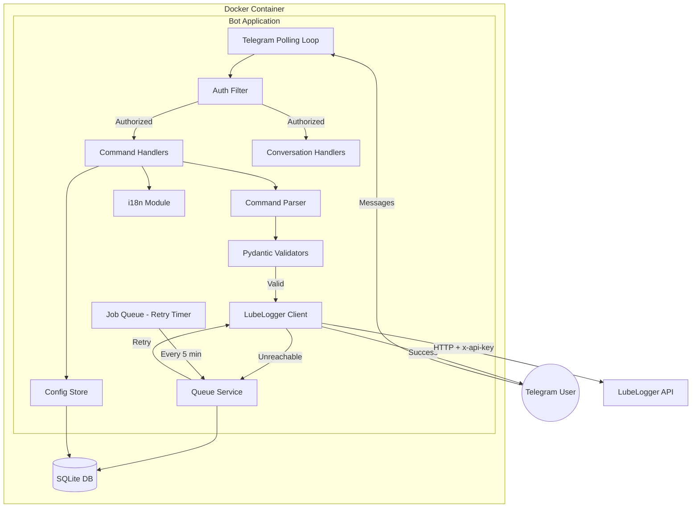
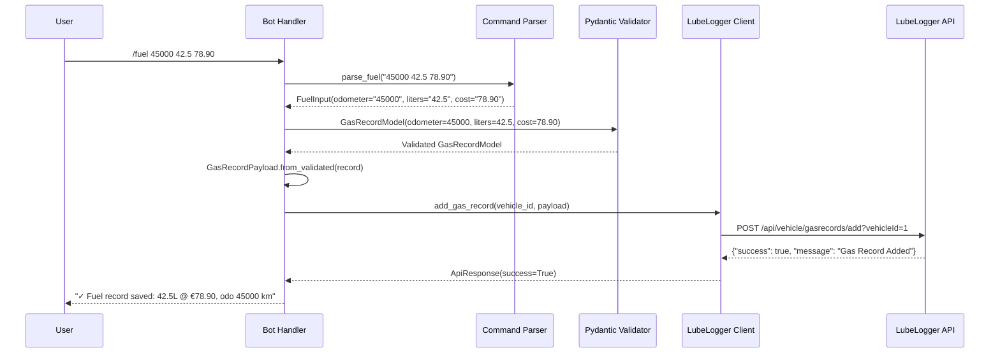
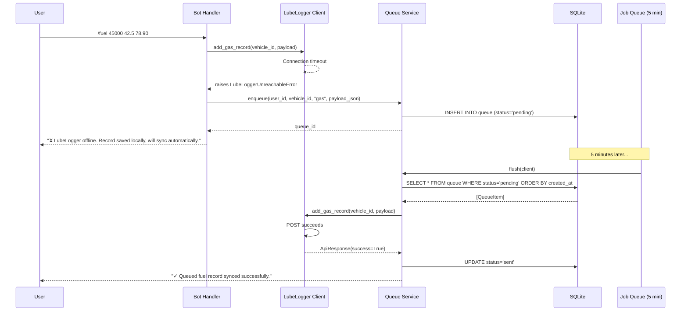
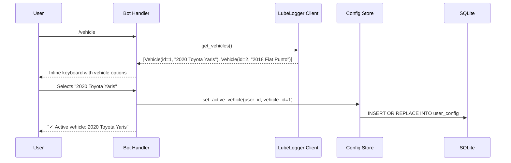

# Design Document: LubeLogger Telegram Bot

## Overview

The LubeLogger Telegram Bot is a Python async application that bridges Telegram messaging with LubeLogger's REST API. It enables vehicle owners to register fuel fill-ups, service records, and odometer readings via short Telegram commands, without accessing the LubeLogger web UI.

The bot runs as a single Docker container in polling mode (no inbound ports), alongside an existing LubeLogger instance. It persists user configuration and an offline queue in a local SQLite database, ensuring no data loss when LubeLogger is temporarily unreachable.

### Key Design Decisions

| Decision | Rationale |
|----------|-----------|
| `python-telegram-bot` v20+ with `Application` | Async-first, built-in job scheduler, conversation handlers |
| Single shared `httpx.AsyncClient` | Connection pooling, efficient resource usage |
| Pydantic v2 models for validation AND serialization | Single source of truth for field constraints and API payload format |
| SQLite via `aiosqlite` | Zero-config persistence, no separate process, async-compatible |
| `python-telegram-bot` job_queue for queue retry | No additional scheduler dependency needed |
| JSON locale files + thin loader | Community-friendly translations (no Python knowledge needed), same pattern as LubeLogger itself |
| Auth via `filters.User` | Built-in telegram library filter, simple whitelist check |

## Architecture



### Layered Architecture

The application follows a three-layer architecture:

1. **Presentation Layer** (`bot/handlers/`, `bot/middleware/`): Telegram interaction, command routing, conversation flows, auth filtering
2. **Service Layer** (`bot/services/`): Business logic — LubeLogger HTTP client, queue management, config persistence, command parsing
3. **Data Layer** (`bot/models/`): Pydantic models for validation and serialization, SQLite schema

Data flows unidirectionally from presentation → service → data, with the exception of the queue retry job which originates from the service layer.

## Components and Interfaces

### `bot/config.py` — Application Configuration

```python
from pydantic_settings import BaseSettings

class BotConfig(BaseSettings):
    telegram_bot_token: str
    lubelogger_url: str           # e.g. "http://lubelogger:8080"
    lubelogger_api_key: str
    allowed_user_ids: list[int]   # comma-separated in env var
    queue_retry_interval: int = 300  # seconds (5 min)
    http_timeout: int = 10          # seconds
    max_retry_attempts: int = 3
    db_path: str = "/data/bot.db"

    model_config = ConfigDict(env_prefix="", env_file=".env")
```

### `bot/middleware/auth.py` — Authorization Filter

Uses `python-telegram-bot`'s `filters.User(user_id=allowed_ids)` to restrict all handlers. Messages from unauthorized users are silently dropped (no response, no logging of content).

```python
def create_auth_filter(allowed_user_ids: list[int]) -> filters.User:
    """Create a filter that only allows messages from whitelisted user IDs."""
    return filters.User(user_id=allowed_user_ids)
```

### `bot/handlers/` — Command Handlers

| Module | Commands | Description |
|--------|----------|-------------|
| `fuel.py` | `/fuel` | Inline args or conversation flow for gas records |
| `service.py` | `/service` | Inline args or conversation flow for service records |
| `odometer.py` | `/km` | Single-arg odometer entry |
| `vehicle.py` | `/vehicle` | Vehicle selection via inline keyboard |
| `query.py` | `/last`, `/status`, `/queue` | Data consultation and status |
| `settings.py` | `/lang`, `/start` | Language selection, welcome |

Each handler follows this pattern:
1. Parse command arguments (via `CommandParser`)
2. Validate data (via Pydantic model)
3. Submit to LubeLogger (via `LubeLoggerClient`)
4. On failure, queue locally (via `QueueService`)
5. Respond to user in their language (via `i18n`)

### `bot/services/lubelogger_client.py` — HTTP Client

```python
class LubeLoggerClient:
    def __init__(self, base_url: str, api_key: str, timeout: int = 10) -> None: ...

    async def add_gas_record(self, vehicle_id: int, record: GasRecordPayload) -> ApiResponse: ...
    async def add_service_record(self, vehicle_id: int, record: ServiceRecordPayload) -> ApiResponse: ...
    async def add_odometer_record(self, vehicle_id: int, record: OdometerRecordPayload) -> ApiResponse: ...
    async def get_vehicles(self) -> list[Vehicle]: ...
    async def get_latest_odometer(self, vehicle_id: int) -> OdometerRecord | None: ...
    async def get_latest_gas_record(self, vehicle_id: int) -> GasRecord | None: ...
    async def health_check(self) -> bool: ...
```

All methods raise `LubeLoggerUnreachableError` on connection/timeout failure, or `LubeLoggerApiError` on non-success responses.

### `bot/services/queue_service.py` — Offline Queue

```python
class QueueService:
    def __init__(self, db_path: str) -> None: ...

    async def enqueue(self, user_id: int, vehicle_id: int, record_type: str, payload: str) -> int: ...
    async def get_pending(self) -> list[QueueItem]: ...
    async def mark_sent(self, item_id: int) -> None: ...
    async def mark_failed(self, item_id: int) -> None: ...
    async def increment_retry(self, item_id: int) -> int: ...
    async def get_pending_count(self) -> dict[str, int]: ...
    async def flush(self, client: LubeLoggerClient) -> FlushResult: ...
```

### `bot/services/config_store.py` — User Preferences

```python
class ConfigStore:
    def __init__(self, db_path: str) -> None: ...

    async def get_active_vehicle(self, user_id: int) -> int | None: ...
    async def set_active_vehicle(self, user_id: int, vehicle_id: int) -> None: ...
    async def get_language(self, user_id: int) -> str: ...
    async def set_language(self, user_id: int, language: str) -> None: ...
```

### `bot/services/command_parser.py` — Argument Parsing

```python
class CommandParser:
    @staticmethod
    def parse_fuel(args: str) -> FuelInput: ...

    @staticmethod
    def parse_service(args: str) -> ServiceInput: ...

    @staticmethod
    def parse_odometer(args: str) -> OdometerInput: ...

    @staticmethod
    def normalize_decimal(value: str) -> str:
        """Replace comma with dot for decimal separator."""
        ...

    @staticmethod
    def format_fuel(record: FuelInput) -> str: ...

    @staticmethod
    def format_service(record: ServiceInput) -> str: ...

    @staticmethod
    def format_odometer(record: OdometerInput) -> str: ...
```

### `bot/i18n.py` — Internationalization

Translation strings are stored as JSON files in `bot/locales/`, one per language:

```
bot/locales/
├── en.json    # English (default, complete)
└── it.json    # Italian
```

Each JSON file is a flat key-value dictionary:

```json
{
  "welcome": "Welcome! Use /vehicle to select your car.",
  "fuel_saved": "✓ Fuel record saved: {liters}L @ €{cost}, odo {odometer} km",
  "fuel_queued": "⏳ LubeLogger offline. Record saved locally, will sync automatically.",
  "invalid_odometer": "❌ Odometer must be a positive number.",
  "usage_fuel": "Usage: /fuel <odometer> <liters> <cost>"
}
```

The loader module caches translations in memory and falls back to English for missing keys:

```python
import json
from pathlib import Path

_LOCALES_DIR = Path(__file__).parent / "locales"
_cache: dict[str, dict[str, str]] = {}

def _load(lang: str) -> dict[str, str]:
    if lang not in _cache:
        path = _LOCALES_DIR / f"{lang}.json"
        if path.exists():
            _cache[lang] = json.loads(path.read_text(encoding="utf-8"))
        else:
            _cache[lang] = _load("en")
    return _cache[lang]

def get_text(key: str, lang: str = "en", **kwargs: Any) -> str:
    """Get localized message with fallback to English. Supports {placeholder} formatting."""
    messages = _load(lang)
    template = messages.get(key) or _load("en").get(key, key)
    return template.format(**kwargs) if kwargs else template
```

Adding a new language requires only creating a new JSON file (e.g., `de.json`) — no Python code changes needed. This mirrors the same translation pattern used by LubeLogger itself (`hargata/lubelog_translations`).

## Data Models

### Input Models (Command Parser Output)

These represent raw parsed user input before validation:

```python
@dataclass
class FuelInput:
    odometer: str
    liters: str
    cost: str
    date: str | None = None
    is_fill_to_full: bool = True
    missed_fuel_up: bool = False

@dataclass
class ServiceInput:
    odometer: str
    description: str
    cost: str
    date: str | None = None

@dataclass
class OdometerInput:
    odometer: str
    date: str | None = None
```

### Validation Models (Pydantic)

These validate user input and produce typed, constrained values:

```python
class GasRecordModel(BaseModel):
    """Validates fuel record input."""
    model_config = ConfigDict(strict=False)

    date: str = Field(default_factory=lambda: date.today().isoformat())
    odometer: int = Field(gt=0)
    liters: float = Field(gt=0)
    cost: float = Field(ge=0)
    is_fill_to_full: bool = True
    missed_fuel_up: bool = False

class ServiceRecordModel(BaseModel):
    """Validates service record input."""
    model_config = ConfigDict(strict=False)

    date: str = Field(default_factory=lambda: date.today().isoformat())
    odometer: int = Field(gt=0)
    description: str = Field(min_length=1)
    cost: float = Field(ge=0)

    @field_validator("description")
    @classmethod
    def description_not_whitespace(cls, v: str) -> str:
        if not v.strip():
            raise ValueError("Description cannot be empty or whitespace-only")
        return v.strip()

class OdometerRecordModel(BaseModel):
    """Validates odometer record input."""
    model_config = ConfigDict(strict=False)

    date: str = Field(default_factory=lambda: date.today().isoformat())
    odometer: int = Field(gt=0)
```

### API Payload Models (LubeLogger format — all strings)

These serialize validated data into the exact format LubeLogger expects:

```python
class GasRecordPayload(BaseModel):
    """Matches LubeLogger GasRecordExportModel — all fields as strings."""
    date: str
    odometer: str
    fuelConsumed: str
    cost: str
    isFillToFull: str   # "true" / "false"
    missedFuelUp: str   # "true" / "false"
    notes: str = ""
    tags: str = ""

    @classmethod
    def from_validated(cls, record: GasRecordModel) -> "GasRecordPayload":
        return cls(
            date=record.date,
            odometer=str(record.odometer),
            fuelConsumed=str(record.liters),
            cost=str(record.cost),
            isFillToFull=str(record.is_fill_to_full).lower(),
            missedFuelUp=str(record.missed_fuel_up).lower(),
        )

class ServiceRecordPayload(BaseModel):
    """Matches LubeLogger GenericRecordExportModel — all fields as strings."""
    date: str
    odometer: str
    description: str
    cost: str
    notes: str = ""
    tags: str = ""

    @classmethod
    def from_validated(cls, record: ServiceRecordModel) -> "ServiceRecordPayload":
        return cls(
            date=record.date,
            odometer=str(record.odometer),
            description=record.description,
            cost=str(record.cost),
        )

class OdometerRecordPayload(BaseModel):
    """Matches LubeLogger OdometerRecordExportModel — all fields as strings."""
    date: str
    odometer: str
    notes: str = ""
    tags: str = ""

    @classmethod
    def from_validated(cls, record: OdometerRecordModel) -> "OdometerRecordPayload":
        return cls(
            date=record.date,
            odometer=str(record.odometer),
        )
```

### API Response Models

```python
class ApiResponse(BaseModel):
    success: bool
    message: str
    data: dict[str, Any] | None = None

class Vehicle(BaseModel):
    id: int
    year: int | None = None
    make: str = ""
    model: str = ""
    license_plate: str = Field(default="", alias="licensePlate")

    @property
    def display_name(self) -> str:
        parts = [str(self.year) if self.year else "", self.make, self.model]
        name = " ".join(p for p in parts if p).strip()
        return name or f"Vehicle #{self.id}"
```

### Database Models

```python
class QueueItem(BaseModel):
    """Represents a queued record in SQLite."""
    id: int
    user_id: int
    vehicle_id: int
    record_type: str   # "gas" | "service" | "odometer"
    payload: str       # JSON-serialized *Payload model
    status: str        # "pending" | "sent" | "failed"
    retry_count: int = 0
    created_at: str
    updated_at: str

class UserConfig(BaseModel):
    """Represents user preferences in SQLite."""
    user_id: int
    active_vehicle_id: int | None = None
    language: str = "en"
    updated_at: str
```

### SQLite Schema

```sql
CREATE TABLE IF NOT EXISTS queue (
    id INTEGER PRIMARY KEY AUTOINCREMENT,
    user_id INTEGER NOT NULL,
    vehicle_id INTEGER NOT NULL,
    record_type TEXT NOT NULL CHECK(record_type IN ('gas', 'service', 'odometer')),
    payload TEXT NOT NULL,
    status TEXT NOT NULL DEFAULT 'pending' CHECK(status IN ('pending', 'sent', 'failed')),
    retry_count INTEGER NOT NULL DEFAULT 0,
    created_at TEXT NOT NULL,
    updated_at TEXT NOT NULL
);

CREATE INDEX IF NOT EXISTS idx_queue_status ON queue(status);
CREATE INDEX IF NOT EXISTS idx_queue_created ON queue(created_at);

CREATE TABLE IF NOT EXISTS user_config (
    user_id INTEGER PRIMARY KEY,
    active_vehicle_id INTEGER,
    language TEXT NOT NULL DEFAULT 'en',
    updated_at TEXT NOT NULL
);
```

### Sequence Diagrams

#### Fuel Record Entry (Happy Path)



#### Offline Queue and Retry Flow



#### Vehicle Selection Flow



## Correctness Properties

*A property is a characteristic or behavior that should hold true across all valid executions of a system — essentially, a formal statement about what the system should do. Properties serve as the bridge between human-readable specifications and machine-verifiable correctness guarantees.*

### Property 1: Auth filter correctness

*For any* Telegram user ID and any whitelist of allowed user IDs, the auth filter SHALL return `True` if and only if the user ID is a member of the whitelist.

**Validates: Requirements 1.1, 1.2**

### Property 2: Whitelist parsing round-trip

*For any* list of positive integers, serializing them as a comma-separated string and parsing that string back into a list of integers SHALL produce the original list.

**Validates: Requirements 1.3**

### Property 3: API key non-leakage

*For any* API key string and any error condition or formatted message produced by the system, the output string SHALL NOT contain the raw API key value.

**Validates: Requirements 2.4**

### Property 4: Config persistence round-trip

*For any* user ID, vehicle ID, and language code, storing them in the Config_Store and reading them back SHALL produce the same values, including across database re-initialization.

**Validates: Requirements 3.2, 3.4, 11.1, 11.2, 11.3, NF-5.5**

### Property 5: Multi-user config isolation

*For any* two distinct user IDs with independently set preferences, reading the config for one user SHALL return that user's values without being affected by the other user's stored values.

**Validates: Requirements 11.4**

### Property 6: Command parsing round-trip

*For any* valid FuelInput, ServiceInput, or OdometerInput, formatting it as a command string and parsing that string back SHALL produce a record equivalent to the original.

**Validates: Requirements 9.6**

### Property 7: Decimal separator normalization

*For any* valid decimal number, both dot-separated (e.g., `45.2`) and comma-separated (e.g., `45,2`) representations SHALL parse to the same numeric value.

**Validates: Requirements 9.5**

### Property 8: Fuel command argument parsing

*For any* positive integer odometer, positive float liters, and non-negative float cost, formatting them as space-separated arguments and parsing with `parse_fuel()` SHALL produce a FuelInput with those exact values.

**Validates: Requirements 4.2, 9.1**

### Property 9: Validation acceptance of valid inputs

*For any* record where odometer > 0, liters > 0 (fuel only), cost >= 0, and description is non-empty non-whitespace (service only), the respective Pydantic validator SHALL accept the input without raising a validation error.

**Validates: Requirements 10.5, 10.7**

### Property 10: Validation rejection of invalid inputs

*For any* record where at least one field violates its constraint (odometer <= 0, liters <= 0, cost < 0, or description is whitespace-only), the respective Pydantic validator SHALL raise a ValidationError that names the offending field.

**Validates: Requirements 10.1, 10.2, 10.3, 10.4, 10.6, 10.7**

### Property 11: Payload serialization produces all-string fields

*For any* valid GasRecordModel, ServiceRecordModel, or OdometerRecordModel, converting it to the corresponding API payload (via `from_validated()`) SHALL produce an object where every field value is a string.

**Validates: Requirements 4.9, 5.7, 6.5**

### Property 12: Queue FIFO ordering

*For any* sequence of records enqueued at distinct timestamps, `get_pending()` SHALL return them ordered by creation time ascending (oldest first).

**Validates: Requirements 8.5**

### Property 13: Queue enqueue-dequeue consistency

*For any* valid record payload enqueued via `enqueue()`, the item SHALL appear in `get_pending()` results with status `pending`, and after `mark_sent()` it SHALL no longer appear in pending results.

**Validates: Requirements 8.1, 8.4, 8.7**

### Property 14: Queue retry exhaustion marks failure

*For any* queue item, after exactly 3 consecutive failed retry attempts (increment_retry reaching max_retry_attempts), calling `mark_failed()` SHALL set its status to `failed` and it SHALL no longer appear in pending results.

**Validates: Requirements 8.8**

## Error Handling

### Error Categories and Strategies

| Error Type | Source | Strategy | User Impact |
|-----------|--------|----------|-------------|
| `ValidationError` | Pydantic validation | Return specific field error to user | Immediate feedback with field name |
| `ParseError` | Command parser | Return usage hint | Shows correct syntax |
| `LubeLoggerUnreachableError` | httpx timeout/connection | Queue record locally | "Saved locally, will sync" |
| `LubeLoggerApiError` | Non-200 response | Log error, inform user | Specific API error message |
| `ConfigurationError` | Missing env vars | Exit at startup | Logged, non-zero exit |

### Custom Exception Hierarchy

```python
class BotError(Exception):
    """Base exception for all bot errors."""
    pass

class ConfigurationError(BotError):
    """Raised when required configuration is missing or invalid."""
    pass

class ParseError(BotError):
    """Raised when command arguments cannot be parsed."""
    def __init__(self, command: str, hint: str) -> None:
        self.command = command
        self.hint = hint

class LubeLoggerUnreachableError(BotError):
    """Raised when LubeLogger cannot be reached (timeout or connection error)."""
    pass

class LubeLoggerApiError(BotError):
    """Raised when LubeLogger returns a non-success response."""
    def __init__(self, status_code: int, message: str) -> None:
        self.status_code = status_code
        self.message = message
```

### Error Handling Flow

1. **Command parsing errors** → Caught in handler, respond with usage hint
2. **Validation errors** → Caught in handler, respond with field-specific message
3. **LubeLoggerUnreachableError** → Caught in handler, trigger queue enqueue, inform user
4. **LubeLoggerApiError** → Caught in handler, log details, inform user of API rejection
5. **Unexpected errors** → Caught by global error handler, log full traceback, respond with generic message

### Retry Logic (Queue Service)

```python
async def flush(self, client: LubeLoggerClient) -> FlushResult:
    """Process all pending queue items in FIFO order."""
    pending = await self.get_pending()
    sent, failed = 0, 0
    for item in pending:
        try:
            await self._send_item(client, item)
            await self.mark_sent(item.id)
            sent += 1
        except LubeLoggerUnreachableError:
            break  # Stop processing — server is down
        except LubeLoggerApiError:
            new_count = await self.increment_retry(item.id)
            if new_count >= self.max_retries:
                await self.mark_failed(item.id)
                failed += 1
    return FlushResult(sent=sent, failed=failed, remaining=len(pending) - sent - failed)
```

### Logging Strategy

- Use Python `logging` module with structured log format
- Log levels: DEBUG (parsing details), INFO (records created/synced), WARNING (retries), ERROR (failures)
- **Never** log `api_key` or `bot_token` values — redact in log formatter
- Log context: user_id, vehicle_id, record_type, operation

## Testing Strategy

### Framework and Tools

- `pytest` for test execution
- `hypothesis` for property-based tests
- `pytest-asyncio` for async test support
- `unittest.mock.AsyncMock` for mocking async services
- `aiosqlite` in-memory databases for testing persistence

### Test Structure

```
tests/
├── __init__.py
├── conftest.py                 # Shared fixtures (in-memory DB, mock client)
├── test_command_parser.py      # Property tests for parsing + round-trips
├── test_validators.py          # Property tests for validation logic
├── test_payload_serialization.py  # Property test for all-string serialization
├── test_config_store.py        # Property tests for persistence + isolation
├── test_queue_service.py       # Property tests for FIFO, enqueue/dequeue, retries
├── test_auth_filter.py         # Property test for whitelist check
├── test_lubelogger_client.py   # Unit tests with mocked HTTP (header check, error handling)
├── test_handlers.py            # Integration tests for command flows
└── test_i18n.py                # Unit tests for message formatting
```

### Property-Based Testing Configuration

- Library: `hypothesis`
- Minimum iterations: `@settings(max_examples=100)`
- Tag format in docstring: `# Feature: lubelogger-telegram-bot, Property N: <title>`
- Each design property maps to exactly one `test_property_*` function

### Property Test Mapping

| Property | Test File | Test Function |
|----------|-----------|---------------|
| 1: Auth filter correctness | `test_auth_filter.py` | `test_property_auth_filter_correctness` |
| 2: Whitelist parsing round-trip | `test_auth_filter.py` | `test_property_whitelist_parsing_roundtrip` |
| 3: API key non-leakage | `test_lubelogger_client.py` | `test_property_api_key_non_leakage` |
| 4: Config persistence round-trip | `test_config_store.py` | `test_property_config_persistence_roundtrip` |
| 5: Multi-user config isolation | `test_config_store.py` | `test_property_multi_user_isolation` |
| 6: Command parsing round-trip | `test_command_parser.py` | `test_property_command_parsing_roundtrip` |
| 7: Decimal separator normalization | `test_command_parser.py` | `test_property_decimal_separator_normalization` |
| 8: Fuel command argument parsing | `test_command_parser.py` | `test_property_fuel_argument_parsing` |
| 9: Validation acceptance | `test_validators.py` | `test_property_validation_accepts_valid` |
| 10: Validation rejection | `test_validators.py` | `test_property_validation_rejects_invalid` |
| 11: Payload all-string serialization | `test_payload_serialization.py` | `test_property_payload_all_strings` |
| 12: Queue FIFO ordering | `test_queue_service.py` | `test_property_queue_fifo_ordering` |
| 13: Queue enqueue-dequeue | `test_queue_service.py` | `test_property_queue_enqueue_dequeue` |
| 14: Queue retry exhaustion | `test_queue_service.py` | `test_property_queue_retry_exhaustion` |

### Unit Tests (Example-Based)

Cover specific scenarios not suited for property testing:
- Default date values (4.6, 5.6, 6.4)
- Default flag values (4.7, 4.8)
- Startup validation failures (1.4, 2.3, 12.1, 12.2)
- Conversation flow initiation (4.1, 5.1, 6.2)
- Welcome message (12.4)
- Queue status display (8.6)
- Unreachable error messages (7.4, 8.2)
- Vehicle inline keyboard rendering (3.1)

### Integration Tests

- Full command flow: `/fuel 45000 42.5 78.90` → mock LubeLogger → verify response
- Offline flow: command → unreachable → queue → flush → verify send
- Vehicle selection: `/vehicle` → mock API → select → verify persistence

### Running Tests

```bash
uv run pytest                         # All tests
uv run pytest tests/test_validators.py  # Single file
uv run pytest -v -x                   # Verbose, stop at first failure
uv run pytest -k "property"           # Only property tests
```

