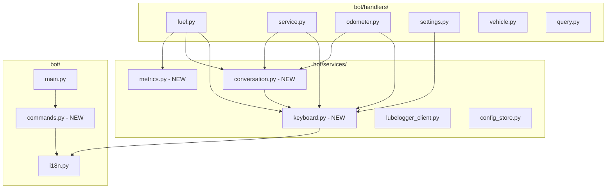
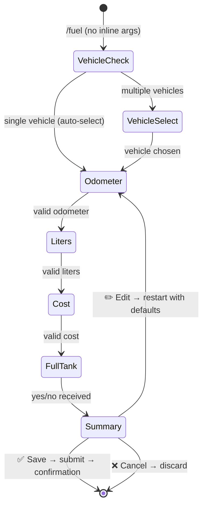

# Design Document: Telegram UX Improvements

## Overview

This design refactors the LubeLogger Telegram bot to provide a polished, guided user experience. The key changes are:

1. **Persistent Reply Keyboard** — an always-visible keyboard with main actions replaces slash-command memorization.
2. **In-place message editing** — the bot edits its previous message during conversation flows instead of flooding the chat.
3. **Progress indicators and summary/confirmation** — users see "Step X/Y" labels and a final summary before submission.
4. **Rich confirmations with consumption metrics** — after saving fuel records, the bot computes and displays L/100km.
5. **BotFather command registration** — commands are registered at startup for autocomplete.
6. **Improved onboarding** — `/start` guides new users through vehicle selection immediately.
7. **Repeat shortcut** — "Log another" button after saving for quick batch entry.

The design maintains backward compatibility with inline-argument modes (e.g., `/fuel 45000 35.2 62.50`) while layering the new UX on the conversation flows.

## Architecture



### New Modules

| Module | Responsibility |
|--------|---------------|
| `bot/services/keyboard.py` | Build and manage Reply/Inline keyboards (main menu, cancel, summary, confirmation) |
| `bot/services/conversation.py` | Shared conversation helpers: progress indicator formatting, in-place edit with fallback, summary rendering |
| `bot/services/metrics.py` | Pure computation of fuel consumption metrics |
| `bot/commands.py` | Build the BotCommand list and register via `setMyCommands` at startup |

### Modified Modules

| Module | Changes |
|--------|---------|
| `bot/main.py` | Call command registration in `post_init`; wire keyboard to `/start` |
| `bot/handlers/settings.py` | Rewrite `/start` for onboarding with vehicle inline keyboard + main reply keyboard |
| `bot/handlers/fuel.py` | Add progress indicators, in-place editing, summary step, confirmation with metrics |
| `bot/handlers/service.py` | Add progress indicators, in-place editing, summary step, confirmation |
| `bot/handlers/odometer.py` | Add progress indicators, in-place editing, summary step, confirmation |
| `bot/locales/en.json` | Add ~25 new i18n keys |
| `bot/locales/it.json` | Add corresponding Italian translations |

## Components and Interfaces

### `bot/services/keyboard.py`

```python
"""Keyboard builder — persistent Reply keyboards and Inline keyboards."""

from __future__ import annotations

from telegram import InlineKeyboardButton, InlineKeyboardMarkup, ReplyKeyboardMarkup

from bot.i18n import get_text


def main_menu_keyboard(lang: str) -> ReplyKeyboardMarkup:
    """Build the persistent main menu Reply keyboard.

    Returns a 1-row keyboard with: ⛽ Fuel, 🔧 Service, 📊 History
    """
    ...


def cancel_keyboard(lang: str) -> ReplyKeyboardMarkup:
    """Build the single-button cancel Reply keyboard for use during conversations."""
    ...


def summary_inline_keyboard(lang: str) -> InlineKeyboardMarkup:
    """Build the Save / Edit / Cancel inline keyboard for summary messages."""
    ...


def confirmation_inline_keyboard(
    record_type: str, lang: str
) -> InlineKeyboardMarkup:
    """Build the 'Log another' / 'History' inline keyboard for confirmations."""
    ...
```

### `bot/services/conversation.py`

```python
"""Shared conversation utilities — progress, in-place editing, summary."""

from __future__ import annotations

from telegram import Message, Update
from telegram.error import BadRequest, TimedOut
from telegram.ext import ContextTypes

from bot.i18n import get_text
from bot.services.keyboard import cancel_keyboard


def format_progress(current_step: int, total_steps: int) -> str:
    """Format a progress indicator string like 'Step 2/4'.

    Args:
        current_step: Current step number (1-based).
        total_steps: Total number of steps in the flow.

    Returns:
        Formatted string e.g. "📍 Step 2/4"

    Raises:
        ValueError: If current_step < 1 or current_step > total_steps.
    """
    ...


def format_summary(fields: dict[str, str], lang: str) -> str:
    """Format a summary message listing all collected field values.

    Args:
        fields: Ordered dict of {label: value} pairs to display.
        lang: User's language code.

    Returns:
        Formatted multi-line summary string with all field values included.
    """
    ...


async def send_or_edit(
    update: Update,
    context: ContextTypes.DEFAULT_TYPE,
    text: str,
    *,
    reply_markup=None,
    message_key: str = "last_bot_message_id",
) -> Message:
    """Edit the previous bot message in-place, or send a new one if editing fails.

    Stores the sent/edited message ID in context.user_data[message_key] for
    subsequent edits.

    Args:
        update: The Telegram update.
        context: The callback context.
        text: The message text to display.
        reply_markup: Optional keyboard markup.
        message_key: Key in user_data to store the message ID.

    Returns:
        The sent or edited Message object.
    """
    ...
```

### `bot/services/metrics.py`

```python
"""Pure computation of fuel consumption metrics."""

from __future__ import annotations


def compute_consumption(
    liters: float,
    current_odometer: int,
    previous_odometer: int,
) -> float | None:
    """Compute fuel consumption in L/100km.

    Formula: liters / (current_odometer - previous_odometer) * 100

    Args:
        liters: Liters of fuel filled.
        current_odometer: Current odometer reading in km.
        previous_odometer: Previous odometer reading in km.

    Returns:
        Consumption in L/100km, or None if the delta is zero or negative.

    Raises:
        ValueError: If liters <= 0.
    """
    if liters <= 0:
        raise ValueError("Liters must be positive")
    delta = current_odometer - previous_odometer
    if delta <= 0:
        return None
    return liters / delta * 100
```

### `bot/commands.py`

```python
"""BotFather command registration at startup."""

from __future__ import annotations

import logging

from telegram import BotCommand
from telegram.ext import Application

from bot.i18n import get_text

logger = logging.getLogger(__name__)

COMMANDS = ["fuel", "service", "km", "vehicle", "last", "status", "lang", "start"]


def build_commands(lang: str) -> list[BotCommand]:
    """Build the list of BotCommand objects with localized descriptions.

    Args:
        lang: The language code for descriptions.

    Returns:
        List of BotCommand with command name and description.
    """
    ...


async def register_commands(app: Application) -> None:
    """Register bot commands with Telegram via setMyCommands.

    Called in post_init. Logs a warning and continues if the call fails.
    """
    try:
        commands = build_commands("en")
        await app.bot.set_my_commands(commands)
        logger.info("Bot commands registered successfully")
    except Exception:
        logger.warning("Failed to register bot commands", exc_info=True)
```

### Conversation Flow Refactoring (Fuel Example)

The refactored fuel conversation adds two new states: `VEHICLE_SELECT` (conditional) and `SUMMARY`.



New conversation states:

```python
VEHICLE_SELECT, ODOMETER, LITERS, COST, FULL_TANK, SUMMARY = range(6)
```

Each step prompt is sent via `send_or_edit()` and includes `format_progress(step, total)`.

### Confirmation Message Structure

After successful save, the confirmation includes:

```
✅ Fuel record saved!

🚗 Vehicle: 2020 Toyota Corolla
📍 Odometer: 45,230 km
⛽ Fuel: 35.2 L
💰 Cost: €62.50
🔋 Full tank: Yes
📅 Date: 2024-01-15
⛽ Consumption: 7.2 L/100km

[🔁 Log another] [📊 History]
```

## Data Models

### No new database tables required

The existing `user_config` table suffices. Conversation state is held in `context.user_data` (in-memory, per user) which already exists.

### Extended `context.user_data` Keys

During a conversation flow, the following keys are used:

| Key | Type | Description |
|-----|------|-------------|
| `last_bot_message_id` | `int` | Message ID of the last bot prompt (for in-place editing) |
| `conv_record_type` | `str` | Record type: "fuel", "service", "odometer" |
| `conv_vehicle_id` | `int` | Selected vehicle ID |
| `conv_vehicle_name` | `str` | Display name of selected vehicle |
| `fuel_odometer` | `int` | Collected odometer value |
| `fuel_liters` | `float` | Collected liters value |
| `fuel_cost` | `float` | Collected cost value |
| `fuel_full_tank` | `bool` | Collected full-tank flag |
| `service_odometer` | `int` | Collected odometer value |
| `service_description` | `str` | Collected description |
| `service_cost` | `float` | Collected cost value |

### New i18n Keys

```json
{
  "keyboard_fuel": "⛽ Fuel",
  "keyboard_service": "🔧 Service",
  "keyboard_history": "📊 History",
  "keyboard_cancel": "❌ Cancel",
  "progress_step": "📍 Step {current}/{total}",
  "summary_title": "📋 Summary — please review:",
  "summary_save": "✅ Save",
  "summary_edit": "✏️ Edit",
  "summary_cancel": "❌ Cancel",
  "confirm_fuel": "✅ Fuel record saved!\n\n🚗 Vehicle: {vehicle}\n📍 Odometer: {odometer} km\n⛽ Fuel: {liters} L\n💰 Cost: €{cost}\n🔋 Full tank: {full_tank}\n📅 Date: {date}",
  "confirm_fuel_consumption": "⛽ Consumption: {consumption} L/100km",
  "confirm_service": "✅ Service record saved!\n\n🚗 Vehicle: {vehicle}\n📍 Odometer: {odometer} km\n🔧 Service: {description}\n💰 Cost: €{cost}\n📅 Date: {date}",
  "confirm_odometer": "✅ Odometer record saved!\n\n🚗 Vehicle: {vehicle}\n📍 Odometer: {odometer} km\n📅 Date: {date}",
  "btn_log_another": "🔁 Log another",
  "btn_history": "📊 History",
  "auto_vehicle_selected": "🚗 Auto-selected: {vehicle}",
  "last_odometer_hint": "Last reading: {odometer} km",
  "start_welcome_new": "Welcome to LubeLogger Bot! I help you track fuel, services, and mileage for your vehicles.\n\nSelect your vehicle to get started:",
  "start_welcome_back": "Welcome back! Your active vehicle: {vehicle}.",
  "start_api_unreachable": "⚠️ Can't reach LubeLogger right now. Try /start again later.",
  "cmd_fuel": "Log a fuel fill-up",
  "cmd_service": "Log a service/maintenance record",
  "cmd_km": "Log an odometer reading",
  "cmd_vehicle": "Select active vehicle",
  "cmd_last": "Show last fuel or odometer record",
  "cmd_status": "Check LubeLogger connectivity",
  "cmd_lang": "Change language",
  "cmd_start": "Start the bot / onboarding",
  "conversation_cancelled_notice": "❌ Operation cancelled.",
  "edit_fallback_notice": "Continuing..."
}
```

## Correctness Properties

*A property is a characteristic or behavior that should hold true across all valid executions of a system — essentially, a formal statement about what the system should do. Properties serve as the bridge between human-readable specifications and machine-verifiable correctness guarantees.*

### Property 1: Progress indicator formatting

*For any* valid step pair (current_step, total_steps) where 1 ≤ current_step ≤ total_steps and total_steps ≥ 1, the `format_progress` function SHALL produce a string containing both the current_step and total_steps values in "Step {current}/{total}" format.

**Validates: Requirements 4.1**

### Property 2: Consumption metric formula correctness

*For any* positive liters value and any (current_odometer, previous_odometer) pair where current_odometer > previous_odometer > 0, `compute_consumption(liters, current_odometer, previous_odometer)` SHALL return `liters / (current_odometer - previous_odometer) * 100`, and the result SHALL always be positive.

**Validates: Requirements 5.2**

### Property 3: Summary message completeness

*For any* non-empty dictionary of field label/value pairs, the `format_summary` function SHALL produce a string that contains every value from the input dictionary.

**Validates: Requirements 4.4**

### Property 4: Confirmation message completeness

*For any* valid fuel record data (vehicle name, odometer > 0, liters > 0, cost ≥ 0, full_tank boolean, date string), the fuel confirmation formatter SHALL produce a string containing all provided field values. Similarly, for any valid service record data, the service confirmation formatter SHALL include vehicle name, odometer, description, and cost.

**Validates: Requirements 5.1, 5.5**

### Property 5: Command descriptions completeness

*For any* supported language code, the `build_commands` function SHALL return exactly 8 BotCommand objects, one for each registered command, and each BotCommand SHALL have a non-empty description string.

**Validates: Requirements 2.2**

## Error Handling

| Scenario | Handling |
|----------|----------|
| `edit_message_text` raises `BadRequest` or `TimedOut` | Fall back to `send_message`; store new message ID for subsequent edits |
| LubeLogger unreachable during vehicle fetch (onboarding) | Show error message, suggest `/start` later |
| LubeLogger unreachable during last-odometer fetch | Skip the reference hint, prompt without it |
| `setMyCommands` fails at startup | Log WARNING, continue startup normally |
| LubeLogger unreachable during record save | Queue the record (existing queue_service behavior unchanged) |
| User sends unexpected input during conversation | Existing validation logic re-prompts with error; now includes progress indicator |
| Conversation data missing (e.g., user_data key absent) | Cancel conversation gracefully, restore main keyboard |

## Testing Strategy

### Property-Based Tests (Hypothesis)

The following properties will be tested with `hypothesis` (minimum 100 examples each):

1. **`test_property_progress_indicator_format`** — Validates Property 1
   - Generators: `current_step = st.integers(min_value=1, max_value=total_steps)`, `total_steps = st.integers(min_value=1, max_value=20)`
   - Asserts output matches `"📍 Step {current}/{total}"` format

2. **`test_property_consumption_metric_formula`** — Validates Property 2
   - Generators: `liters = st.floats(min_value=0.1, max_value=200.0)`, `current_odo = st.integers(min_value=2, max_value=999999)`, `previous_odo` drawn less than `current_odo`
   - Asserts `result == liters / (current - previous) * 100` and `result > 0`

3. **`test_property_summary_message_completeness`** — Validates Property 3
   - Generators: `fields = st.dictionaries(st.text(min_size=1, max_size=30), st.text(min_size=1, max_size=50), min_size=1, max_size=10)`
   - Asserts every value string appears in the formatted output

4. **`test_property_confirmation_message_completeness`** — Validates Property 4
   - Generators: random vehicle names, odometer > 0, liters > 0, cost ≥ 0, boolean full_tank, date strings
   - Asserts all field values appear in the formatted confirmation string

5. **`test_property_command_descriptions_completeness`** — Validates Property 5
   - Generators: `lang = st.sampled_from(["en", "it"])`
   - Asserts `len(build_commands(lang)) == 8` and all descriptions are non-empty

### Unit Tests (Example-Based)

- Keyboard builders return correct button labels for each language
- Button-to-command dispatch mapping
- Cancel handler clears user_data and attaches main keyboard
- Edit callback restarts flow at step 1 with preserved data
- `/start` onboarding flow: new user → vehicle list; returning user → welcome-back
- `setMyCommands` failure logs warning and doesn't crash
- `send_or_edit` falls back to send when `BadRequest` is raised
- Consumption returns `None` when no previous record exists
- Auto-select fires only when exactly 1 vehicle is available

### Integration Tests

- Full conversation flow end-to-end with mocked LubeLogger client
- Reply keyboard persists across multiple non-conversation messages
- In-place editing works across sequential conversation steps
- "Log another" starts a new flow with pre-selected vehicle

### Test Configuration

```python
from hypothesis import settings

@settings(max_examples=100)
# Feature: telegram-ux-improvements, Property 1: Progress indicator formatting
def test_property_progress_indicator_format(...):
    ...
```

### Test File Structure

```
tests/
├── test_keyboard.py          # Unit tests for keyboard builders
├── test_conversation.py      # Property + unit tests for conversation helpers
├── test_metrics.py           # Property tests for consumption formula
├── test_commands.py          # Property + unit tests for command registration
├── test_confirmation.py      # Property tests for confirmation formatters
├── test_onboarding.py        # Unit tests for /start flow
├── test_flow_integration.py  # Integration tests for full conversation flows
```
